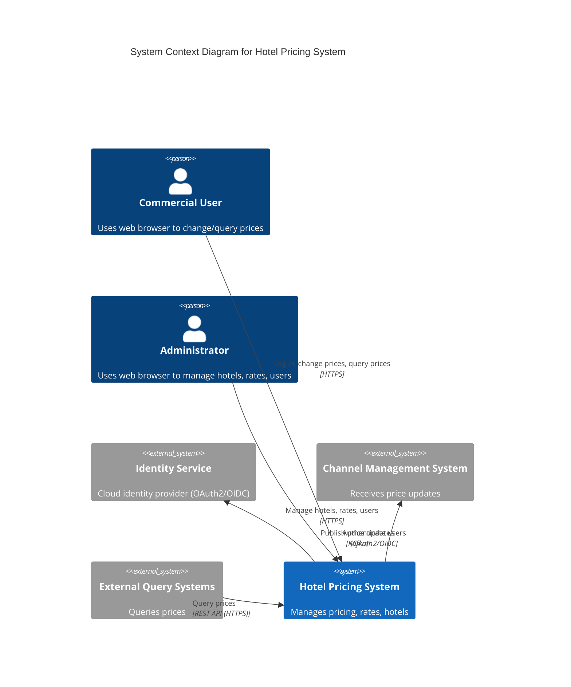
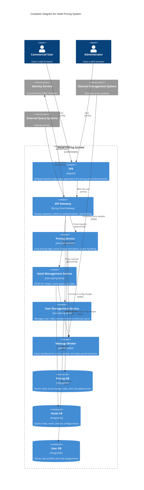
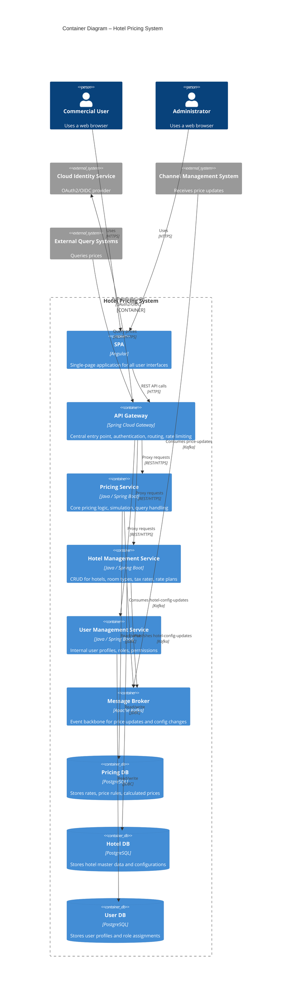

# Iteration 1 - Conversation Log

**Goal**: Establishing an Overall System Structure

**Generated**: 2026-06-11T10:16:09.5428178

---

### Orchestrator (Coordinator)

**Timestamp**: 2026-06-11T10:03:54.0952204

## Orchestration Action: ADD Step 1 – Review Inputs  
**Iteration 1:** Establishing an Overall System Structure  

### Step 1 Execution Summary
All provided inputs have been reviewed:  

| Type | Identifiers |
|------|-------------|
| Primary Functionality | HPS-1 … HPS-6 |
| Quality Attributes | QA-1 … QA-9 |
| Architectural Concerns | CRN-1 … CRN-5 |
| Constraints | CON-1 … CON-6 |

The following requirements are designated as **architectural drivers** for this iteration, because they directly influence the overall structure of the system:

1. **CRN-1 – Overall System Structure**  
   *Explicitly requests a coherent high‑level architecture – the core goal of this iteration.*

2. **CON-6 – Cloud‑Native Architecture**  
   *Mandates patterns such as microservices, containerization, and elastic scaling that fundamentally shape deployment and component boundaries.*

3. **CON-1 – Web Browser Access**  
   *Requires a browser‑based UI, driving a clear split between front‑end and back‑end and influencing API design.*

4. **CON-2 – Cloud Identity & Hosting**  
   *Enforces use of a cloud‑native identity provider and cloud hosting; this dictates authentication flows, service‑to‑service security, and deployment topology.*

5. **CRN-2 – Technology Stack: Java, Angular, Kafka**  
   *Constrains the implementation platforms, pushing the design toward a Java‑backed services tier, an Angular single‑page front‑end, and Kafka‑based asynchronous messaging.*

6. **CON-4 – 6‑Month Delivery**  
   *The aggressive timeline forces decisions that maximize reuse, leverage managed services, and support independent, parallel development streams – critical for choosing the right modularity and deployment approach.*

**Why these drivers are prioritized:** All of them carry the highest weight in defining the system’s first‑level decomposition. Quality attributes (QA‑1 through QA‑9) and remaining concerns (CRN‑3 through CRN‑5) are acknowledged but will be addressed as primary drivers in subsequent refinement iterations, once the overall skeleton is established (e.g., specific performance or security mechanisms). Functional scenarios (HPS‑1 – HPS‑6) will guide the allocation of responsibilities later in this iteration (Step 5).

### Next Steps for the Team

#### 🔹 Designer – Focus for Step 2 and beyond:
- **Step 2 (Establish Iteration Goal):** Formulate a precise iteration goal that references these six drivers, aiming to produce a high‑level system context diagram and an initial modular structure (e.g., front‑end, back‑end services, messaging backbone, identity integration).  
- **Step 3–4:** Choose the most important system elements (user, external systems, main application) and explore design concepts that satisfy all six drivers simultaneously – for example, a backend‑for‑frontend pattern, event‑driven microservices, and containerised deployments on the chosen cloud platform.  
- **Step 5–6:** Instantiate those concepts into logical components, allocate responsibilities, sketch the system context diagram, and record every design decision with a trace back to the driver(s) it addresses.

#### 🔹 Reviewer – Verification points:
- Confirm that all six drivers are accounted for in the iteration goal and that no essential structuring concern (e.g., CON‑5 REST API constraint) was omitted that would later force a radical redesign.  
- Ensure that the Designer’s proposals respect cloud‑native principles and the mandated stack, and that the selected structure avoids premature commitment to details that belong to later iterations.  
- Check that the design rationale explicitly maps each architectural decision to at least one of the selected drivers, with priority given to the constraints and concerns listed above.

Proceed with Step 2.

---

### Designer (Architecture Designer)

**Timestamp**: 2026-06-11T10:04:29.1902937

## ADD Step 1 – Review Inputs  
**Iteration 1: Establishing an Overall System Structure**

### Inputs Reviewed  
The following inputs from the case study were thoroughly examined:

| Category | Identifiers |  
|----------|--------------|  
| Primary Functionality (Use Cases) | HPS-1 (Log In), HPS-2 (Change Prices), HPS-3 (Query Prices), HPS-4 (Manage Hotels), HPS-5 (Manage Rates), HPS-6 (Manage Users) |  
| Quality Attribute Scenarios | QA-1 (Performance), QA-2 (Reliability), QA-3 (Availability), QA-4 (Scalability), QA-5 (Security), QA-6 (Modifiability), QA-7 (Deployability), QA-8 (Monitorability), QA-9 (Testability) |  
| Architectural Concerns | CRN-1 (Overall system structure), CRN-2 (Leverage Java, Angular, Kafka), CRN-3 (Work allocation), CRN-4 (Avoid technical debt), CRN-5 (Continuous deployment infrastructure) |  
| Constraints | CON-1 (Web browser access), CON-2 (Cloud identity & hosting), CON-3 (Proprietary Git), CON-4 (6‑month delivery / 2‑month MVP), CON-5 (REST APIs initially), CON-6 (Cloud‑native approach) |  

### Architectural Drivers for This Iteration  

For the goal of **defining an overall system structure**, the following requirements are designated as the highest‑priority architectural drivers. They directly shape the first‑level decomposition, technology choices, and deployment topology.

| Priority | Driver | Justification |  
|----------|--------|---------------|  
| **1** | **CRN-1 – Overall system structure** | The explicit concern demands a coherent macro‑architecture; this is the very purpose of the iteration. |  
| **2** | **CON-6 – Cloud‑native approach** | Mandates fundamental architectural patterns: containerization, orchestration, managed services, and elastic scaling. Drives the separation into independently deployable units. |  
| **3** | **CON-1 – Web browser access** | Enforces a clear front‑end/back‑end split and influences API design, UI composition, and the choice of a single‑page application framework (Angular, per CRN-2). |  
| **4** | **CON-2 – Cloud identity & hosting** | Dictates authentication flows (OAuth2/OIDC), service‑to‑service security, and the use of the cloud provider’s identity service. Coupled with CON-6, it pushes toward fully managed identity integration. |  
| **5** | **CRN-2 – Technology stack (Java, Angular, Kafka)** | Constrains the implementation platforms. Justifies a Java‑based services tier (Spring Boot / Quarkus), an Angular front‑end, and Kafka as the asynchronous messaging backbone. |  
| **6** | **CON-4 – 6‑month delivery (2‑month MVP)** | The aggressive timeline forces architectural decisions that maximize parallelism and reuse: independently testable modules, clean interfaces, and heavy reliance on cloud‑managed services to reduce plumbing effort. |  

### Why Other Requirements Are Deferred  

- **Functional use cases (HPS-1–HPS-6)**: They drive the allocation of responsibilities *within* the structure, but do not dictate the overall modular boundaries themselves. They will be the primary basis for refining components in later iterations.  
- **Quality attributes QA-1–QA-9**: Each of these is critical, but the mechanisms to satisfy them (caching, outbox patterns, circuit breakers, etc.) are tactical refinements. They will become primary drivers in subsequent design rounds after the high‑level structure is established.  
- **Concerns CRN-3, CRN-4, CRN-5**: CRN-3 (work allocation) and CRN-4 (avoid technical debt) are process‑oriented and will be addressed by the chosen modularity (well‑defined components, clear interfaces). CRN-5 (continuous deployment) will be enabled by the cloud‑native and container‑first approach (CON-6) but is not itself a structural driver.  
- **Constraints CON-3 (proprietary Git) and CON-5 (REST APIs)**: CON-3 is purely infrastructural and does not affect architecture style. CON-5 is an interface constraint that will be encapsulated behind abstractions in the detailed design; it does not alter the system’s high‑level partitioning.  

The selected six drivers together form a coherent foundation for establishing the system context, identifying major architectural elements, and choosing the overarching patterns (e.g., microservices with an API gateway, event‑driven communication via Kafka, cloud‑managed identity). The next step (Step 2) will formulate the precise iteration goal based on these drivers.

---

### Reviewer (Architecture Reviewer)

**Timestamp**: 2026-06-11T10:05:15.0515421

## Overall Assessment: **PASS**  
The design correctly identifies the architectural drivers for the first iteration and provides a clear, traceable justification for each. The selection accurately reflects the primary structuring forces of the Hotel Pricing System (HPS) as required by ADD Step 1.

## Strengths  
- **Completeness of Driver Selection** – All six high-priority drivers (CRN‑1, CON‑6, CON‑1, CON‑2, CRN‑2, CON‑4) are listed and ranked according to their direct impact on the overall system structure. Their influence on modularity, technology, deployment, and delivery is convincingly explained.  
- **Justified Deferral** – The design transparently explains why functional use cases, explicit quality‑attribute scenarios, and remaining concerns/constraints are **not** treated as primary structural drivers for this iteration. The reasoning (tactical refinements, interface details, or process‑oriented concerns) is logically sound and prevents premature over‑design.  
- **Alignment with ADD Methodology** – The output follows the prescribed ADD Step 1 format: it reviews all inputs, designates drivers with a clear rationale, and explicitly links them to the iteration goal (“Establishing an Overall System Structure”).  
- **Consideration of Trade‑offs** – The document implicitly acknowledges the tension between the aggressive timeline (CON‑4) and the need for a robust, cloud‑native modularisation (CON‑6) by emphasising independent deployment, clean interfaces, and managed services.

## Issues Found  
No significant issues were detected. The driver selection is appropriate, and the prioritisation does not overlook any constraint or concern that would fundamentally alter the high‑level architecture.

## Suggestions  
1. **Future Iterations – Protocol Extensibility (QA‑6 & CON‑5)**  
   While correctly deferred now, the requirement to later support protocols like gRPC *without core changes* should be briefly flagged as a cross‑cutting concern for future refinement. Including a one‑line note (e.g., “Design interfaces to be protocol‑agnostic when possible”) would improve traceability without adding detail at this stage.

2. **Reference to Non‑Functional Drivers**  
   The text could mention that QA‑1 (performance) and QA‑2 (reliability) will heavily influence the internal structure of the pricing service in later iterations, ensuring the current high‑level decomposition does not inadvertently preclude the necessary mechanisms (e.g., event‑driven, CQRS). This is already implied by the list of deferred QAs but could be made more explicit.

These suggestions are minor and do not affect the correctness of the driver selection; they are offered as enhancements for the design record, not as required fixes.

## Decision  
**Accept** – The design satisfies the iteration goal for ADD Step 1. The architectural drivers are correctly identified, prioritised, and justified, and they form a solid basis for moving to Step 2 (Establish the Iteration Goal) and beyond. No revision is required.

---

### Orchestrator (Coordinator)

**Timestamp**: 2026-06-11T10:05:40.6865338

## Orchestration Action: ADD Step 2 – Establish the Iteration Goal by Selecting Drivers  
**Iteration 1:** Establishing an Overall System Structure  

### Step 2 Execution  

The selection of architectural drivers was completed in Step 1 and has been uniformly accepted by the Designer and Reviewer. The following six drivers are formally designated as the **iteration drivers** for Iteration 1:

| # | Driver | Rationale for Inclusion |
|---|--------|-------------------------|
| 1 | CRN‑1 – Overall System Structure | The explicit architectural concern that gives this iteration its name. |
| 2 | CON‑6 – Cloud‑Native Approach | Mandates microservices, containerisation, elastic scaling. |
| 3 | CON‑1 – Web Browser Access | Enforces a clear front‑end / back‑end separation and browser‑based UI. |
| 4 | CON‑2 – Cloud Identity & Hosting | Requires integration with a cloud‑native identity provider and full cloud hosting. |
| 5 | CRN‑2 – Technology Stack (Java, Angular, Kafka) | Constrains language, framework, and event‑streaming choices. |
| 6 | CON‑4 – 6‑Month Delivery (2‑Month MVP) | Drives modularity for parallel work, reuse, and reliance on managed services. |

These drivers will now be combined into a single, focused **iteration goal** that steers the subsequent design decisions (Steps 3‑7).

---

### 🔹 Designer – Focus for Step 2  

Formulate the **iteration goal statement** for Iteration 1. The statement must:

- Explicitly mention the overall system structure as the target of the iteration.  
- Encompass the six selected drivers, showing how they collectively shape the intended architecture.  
- Be concise (one to three sentences) and concrete enough to guide the creation of the system context and the initial decomposition in later steps.  

*Example structure:*  
> “Produce a high‑level system decomposition that satisfies CRN‑1 by … while adhering to CON‑6, CON‑1, CON‑2, CRN‑2, and CON‑4.”  

The goal should convey **what** the design will achieve and **which drivers** it directly answers.

---

### 🔹 Reviewer – Verification Points  

When the Designer presents the iteration goal, verify the following:

- **Completeness:** All six selected drivers are referenced or clearly implied.  
- **Coherence:** The goal ties the drivers into a unified purpose rather than listing them disjointedly.  
- **Scope Control:** The goal does not inadvertently pull in deferred concerns (e.g., detailed security mechanisms, performance tuning) that belong to later iterations.  
- **Traceability:** The wording makes it obvious which architectural outcome addresses which driver, providing a clear baseline for Step 3 (Choose One or More Elements of the System to Refine).  

If the goal meets these criteria, we proceed. Otherwise, guide the Designer toward a tighter formulation.

Proceed with Step 2.

---

### Designer (Architecture Designer)

**Timestamp**: 2026-06-11T10:06:10.3390324

## ADD Step 2 – Establish the Iteration Goal  
**Iteration 1: Establishing an Overall System Structure**

The following architectural drivers were selected in Step 1 and are now the sole basis for the iteration goal.  
All other requirements (specific QAs, remaining concerns, detail‑level constraints) are intentionally deferred to later iterations.

| # | Driver            | Category         | Core Influence on This Iteration |
|---|-------------------|------------------|----------------------------------|
| 1 | **CRN‑1**         | Concern          | Must produce a coherent, high‑level system decomposition. |
| 2 | **CON‑6**         | Constraint       | Mandates a cloud‑native architecture: microservices, containerisation, managed services. |
| 3 | **CON‑1**         | Constraint       | Browser‑based UI → clear front‑end / back‑end separation and Angular (per CRN‑2). |
| 4 | **CON‑2**         | Constraint       | Cloud‑provider identity service for authentication; full cloud hosting for all components. |
| 5 | **CRN‑2**         | Concern          | Leverage Java (back‑end), Angular (front‑end), and Kafka (event streaming). |
| 6 | **CON‑4**         | Constraint       | 6‑month delivery, 2‑month MVP → structure must enable parallel work, independent testability, and off‑load of infrastructure concerns to cloud‑managed services. |

### Iteration Goal Statement

> **“Produce a first‑level system decomposition (CRN‑1) that organises the Hotel Pricing System as a cloud‑native solution (CON‑6) with a browser‑based Angular front‑end and a set of Java microservices communicating via Kafka (CRN‑2), all hosted on a managed cloud platform and protected by a cloud‑identity provider (CON‑2). The decomposition must support parallel development, early MVP delivery, and a clear separation of responsibilities, ensuring that the architecture can be delivered within the 6‑month timeline (CON‑4).”**

### Traceability Summary

| Goal Fragment                                                                 | Addressed Driver |
|-------------------------------------------------------------------------------|------------------|
| Produce a first‑level system decomposition                                    | CRN‑1            |
| Cloud‑native solution (microservices, containerisation, managed services)     | CON‑6            |
| Browser‑based Angular front‑end / Java microservices / Kafka                  | CRN‑2 + CON‑1    |
| Hosted on a managed cloud platform with cloud‑identity provider               | CON‑2            |
| Supports parallel development, early MVP, clear separation of responsibilities| CON‑4            |

### Scope Control

- The goal explicitly avoids prescribing internal mechanisms for specific quality attributes (e.g., caching for QA‑1, transactional outbox for QA‑2) — those will be refined in later iterations once the macro‑structure is stable.
- Protocol‑specific decisions (CON‑5 – REST initially) are encapsulated behind the back‑end APIs and do not change the decomposition; they are acknowledged but not part of the structural drivers.
- The goal provides a concrete target for the next steps: creation of a **system context diagram** and an initial set of **principal components** (e.g., API Gateway, Auth Service, Price Management Service, Kafka broker, Angular SPA) as outlined by the ADD method.

This iteration goal will steer Step 3 (choosing elements to refine) and all subsequent design decisions in Iteration 1.

---

### Orchestrator (Coordinator)

**Timestamp**: 2026-06-11T10:06:43.2906861

## Orchestration Action: ADD Step 3 – Choose Elements to Refine  
**Iteration 1: Establishing an Overall System Structure**

### Step 3 Execution
The project is a **greenfield development**; therefore there are no pre-existing elements to refine. The only element available is **the Hotel Pricing System as a whole**. This single element is selected for refinement in this iteration.

Because this is a new system, the first refinement task is to define its boundaries and interactions with external actors and systems. The design activity for Step 3 is therefore to **create the System Context Diagram** using the C4 model’s “System Context” level (Level 1). This diagram will depict:

- **The Hotel Pricing System** as the central software system.
- **External actors**:  
  - *Commercial Users* (using a web browser)  
  - *Administrators* (using a web browser)  
- **External systems**:  
  - *User Identity Service* (cloud-based, handles authentication)  
  - *Channel Management System* (legacy system receiving price updates)  
  - *External Query Systems* (third-party systems querying for price information)  
- **Interaction flows** between the actors and the Hotel Pricing System, and between the Hotel Pricing System and the external systems, labelled with high-level purpose (e.g., “Log in,” “Change prices,” “Publish rate updates,” “Query prices”).

The diagram should be rendered as a **Mermaid C4 Context diagram** to maintain consistency and enable future refinement into container diagrams.

---

### 🔹 Designer – Focus for Step 3
Produce a Mermaid `C4Context` diagram that includes:

1. A `Person(CommercialUser, "Commercial User")` and a `Person(Administrator, "Administrator")`.
2. A `System(HotelPricingSystem, "Hotel Pricing System", "Manages hotel rates and prices")`.
3. `System_Ext(CMS, "Channel Management System", "Receives price updates")`.
4. `System_Ext(ExternalQuerySystems, "External Query Systems", "Queries prices via API")`.
5. `System_Ext(IdentityService, "User Identity Service", "Cloud identity provider")`.
6. Relationships:
   - `CommercialUser` uses HTTPS to `HotelPricingSystem` for “Log in, change prices, query prices”
   - `Administrator` uses HTTPS to `HotelPricingSystem` for “Manage hotels, rates, users”
   - `HotelPricingSystem` publishes rate updates to `CMS` (eventually via Kafka-based events)
   - `ExternalQuerySystems` queries `HotelPricingSystem` for “Get current prices”
   - `HotelPricingSystem` relies on `IdentityService` for “Authentication and authorisation (OAuth2/OIDC)”

Make sure the diagram is self-contained and clearly delineates the system boundary. Use descriptive labels that align with the iteration goal and the architectural drivers (CON-1, CON-2, CRN-2).

---

### 🔹 Reviewer – Verification Points
When the Designer submits the system context diagram, verify:

- **Completeness:** All required external actors and systems from the case study (Commercial Users, Administrators, Channel Management System, External Query Systems, User Identity Service) are represented.
- **Boundary clarity:** The Hotel Pricing System is the only element inside the boundary; everything else is external.
- **Interaction labels:** Relationships are annotated with the primary purpose and, where relevant, the protocol (e.g., HTTPS, Kafka events). Labels reflect the functional scenarios.
- **Driver alignment:** The diagram supports the iteration goal: cloud-native architecture (implicit by external identity and eventual event-driven communication), web browser access (users via HTTPS), and clear separation of concerns.
- **No premature details:** The diagram is at the correct level of abstraction—no containers, databases, or internal services are shown.
- **Mermaid syntax validity:** The `C4Context` snippet must be syntactically correct for the Mermaid renderer.

If the diagram passes verification, we will proceed to Step 4 (select design concepts) using the defined context as the starting point. If issues are found, the Designer will be asked to revise before moving forward.

Proceed with Step 3.

---

### Designer (Architecture Designer)

**Timestamp**: 2026-06-11T10:08:00.226554

### Design Approach
Since this is a greenfield project, the only architectural element available is the **Hotel Pricing System** as a whole.  
Following ADD Step 3, I have refined this element by creating its **system context diagram** – an outer view that establishes the boundaries of the system, the external actors, and the external systems it must interact with. This directly addresses the iteration goal (CRN‑1), while fully respecting the constraints and concerns identified in Steps 1–2: cloud‑native approach (CON‑6), web browser access (CON‑1), cloud identity (CON‑2), mandated technology stack (CRN‑2), and the aggressive delivery timeline (CON‑4).

The resulting C4 Context diagram is intentionally abstract: it shows **who** and **what** the system communicates with, **over which protocols**, and **why**, but intentionally defers any internal decomposition. It provides the outer scaffold on which the later container and component views will be built.

---

### System Context Diagram (C4 Level 1)


---

### Architectural Elements – Responsibilities and Interfaces

| Element | Type | Responsibility | Provided / Required Interfaces |
|---------|------|----------------|-------------------------------|
| **Commercial User** | Person (external) | Uses a web browser to log in, change room/base rates, simulate price changes, and query current prices. | Consumes: HTTPS web UI served by `HotelPricingSystem`. |
| **Administrator** | Person (external) | Uses a web browser to manage hotels, room types, tax rates, available rates, business rules, and user permissions. | Consumes: HTTPS web UI served by `HotelPricingSystem`. |
| **Hotel Pricing System** | System (core) | Central application that handles authentication, hotel/rate/price management, price recalculation, and exposure of price data to internal and external consumers. | Provides: Web UI (HTTPS), REST API for queries and management; Publishes: Kafka events for price updates; Consumes: OAuth2/OIDC tokens from `IdentityService`. |
| **Identity Service** | System (external, cloud) | Manages user identities and issues access tokens after authentication. Relied upon by `HotelPricingSystem` for all user login and permission enforcement. | Provides: OAuth2/OIDC endpoints (`/authorize`, `/token`, `/userinfo`). |
| **Channel Management System** | System (external) | Consumes hotel price updates and distributes them to various sales channels. Receives changed prices as soon as they become effective. | Consumes: Kafka topic with price update events published by `HotelPricingSystem`. |
| **External Query Systems** | System (external) | Third‑party systems (e.g., travel aggregators) that request up‑to‑date prices for specific hotels and dates. | Consumes: REST API (HTTPS) exposed by `HotelPricingSystem`. |

---

### Traceability to Architectural Drivers

| Design Decision | Addressed Driver(s) | Rationale |
|---------------|---------------------|-----------|
| System context diagram defines the outermost boundary of the HPS. | **CRN‑1** (Overall System Structure) | Fulfills the explicit need to “establish an overall initial system structure” by providing the first‑level decomposition – the system surrounded by its environment. |
| The `IdentityService` is placed entirely outside the system; HPS relies on it via OAuth2/OIDC. | **CON‑2** (Cloud Identity & Hosting) | Enforces the constraint that authentication is delegated to a cloud‑managed identity service, keeping the HPS free of built‑in credential stores. |
| All user interactions (`CommercialUser`, `Administrator`) are over HTTPS. | **CON‑1** (Web Browser Access) | Guarantees browser‑based access on any platform, with a clear separation between the client (Angular SPA) and server. |
| The `HotelPricingSystem` publishes price updates to the `CMS` via **Kafka**. | **CRN‑2** (Technology Stack – Kafka) | Leverages the team’s knowledge of Kafka and establishes an event‑driven backbone that will later satisfy reliability (QA‑2) and performance (QA‑1) requirements. |
| `ExternalQuerySystems` interact with HPS through a **REST API** (HTTPS). | **CON‑5** (REST APIs initially) | Respects the constraint that external communication starts with REST, while the abstraction of an API layer allows later addition of protocols like gRPC (QA‑6) without changing the context diagram. |
| All components are shown as logically external to the HPS, with the system itself treated as a single undivided unit. | **CON‑6** (Cloud‑Native Approach), **CON‑4** (6‑Month Delivery) | Cloud‑native principles are kept implicit – the context says nothing about internal containers or orchestration, allowing a quick MVP design (front‑end, a few micro‑services) that can be incrementally refined. The clear boundaries enable independent work streams and parallel development. |
| The `ExternalQuerySystems` boundary is separated from the internal UI. | **CRN‑3** (Work Allocation), **CON‑4** | Allows the team to develop the query API layer independently from the administrative UI, reducing coupling and shortening the path to the MVP. |

The system context diagram forms the required outer view and will serve as the foundation for Step 4, where we decompose the `HotelPricingSystem` into its first internal elements.

---

### Orchestrator (Coordinator)

**Timestamp**: 2026-06-11T10:09:13.3415173

## ADD Steps 4–5 – Choose Design Concepts & Instantiate Elements  
**Iteration 1: Establishing an Overall System Structure**

### Step 4 – Choose Design Concepts  

Two architectural patterns are evaluated against the iteration drivers.  

**Alternative A: Three‑Tier Monolith**  
- A single deployable unit containing presentation (Angular SPA served as static content), a business logic tier (Java backend), and a data tier.  
- Communication is typically synchronous (REST) and tightly coupled.  

**Alternative B: Microservices with API Gateway**  
- Multiple independently deployable services, each encapsulating a distinct business capability.  
- Frontend as a separate Angular application served from a CDN/object store.  
- An API Gateway handles external ingress, authentication, and routing.  
- Services communicate asynchronously via Kafka and synchronously via REST where appropriate.  
- Each service owns its own data store (polyglot persistence per service).  

#### Evaluation Against Architectural Drivers  

| Driver | Three‑Tier Monolith | Microservices (Selected) |
|--------|---------------------|---------------------------|
| **CON‑6 – Cloud‑Native** | Can be containerised but does not fully leverage cloud‑native patterns (independent scaling, fault isolation, blue‑green deployments). | Inherently supports elastic scaling per service, container orchestration, managed services, and loose coupling – core cloud‑native tenets. |
| **CON‑4 – 6‑Month Delivery (2‑Month MVP)** | Shared codebase can initially speed up development but quickly leads to merge conflicts and slows down parallel work. Tight coupling makes independent testing difficult. | Enables parallel development streams (Frontend, Pricing, Hotel/User Management, Integration). Each service can be built, tested, and deployed independently, directly addressing the aggressive timeline. |
| **CON‑1 – Web Browser Access** | Both can deliver a browser‑based UI; however, the SPA as a separate artefact in microservices better decouples frontend releases from backend changes. | SPA is a dedicated frontend micro‑application, can be deployed independently to a CDN and can call the API Gateway. |
| **CON‑2 – Cloud Identity & Hosting** | OAuth2/OIDC can be integrated, but security boundaries are blurred in a monolith. | The API Gateway becomes the security choke point, offloading authentication to the cloud identity service and passing validated JWT tokens to services – a cleaner separation of concerns. |
| **CRN‑2 – Technology Stack (Java, Angular, Kafka)** | Angular can be the UI, Java the backend, but Kafka integration is an afterthought in a monolith, often leading to complex event‑handling embedded in a single process. | Kafka is a first‑class citizen, serving as the event backbone for price updates, enabling reliable asynchronous communication and eventual consistency. |
| **CRN‑1 – Overall System Structure** | Provides a coarse structure but lacks the fine‑grained decomposition explicitly requested. | Yields a clear, modular architecture with well‑defined boundaries, APIs, and event flows – directly satisfying the need for a “coherent high‑level architecture”. |

**Design Decision**  
**Microservices architecture with an API Gateway is selected.** This pattern directly satisfies all high‑priority drivers: cloud‑native principles (CON‑6), parallel development and MVP delivery (CON‑4), clean front‑end separation (CON‑1), cloud identity integration via a gateway (CON‑2), and a native event‑driven backbone using Kafka (CRN‑2). The three‑tier monolith would hinder the required delivery speed and cloud‑native adoption.

---

### Step 5 – Instantiate Architectural Elements  

The chosen microservices pattern is refined into a first‑level container decomposition of the **Hotel Pricing System**. The C4 Container diagram below shows the principal run‑time containers, their technologies, and primary communication paths.



#### Element‑by‑Element Responsibilities and Interfaces  

| Element | Type | Responsibility | Provided Interfaces | Required Interfaces |
|---------|------|----------------|----------------------|---------------------|
| **SPA (Single‑Page Application)** | Container: Angular | Hosts all browser‑based UI for commercial users and administrators. Handles routing, form interactions, and communicates exclusively with the API Gateway. | Delivers HTML/JS/CSS over HTTPS; consumes REST APIs from the API Gateway. | REST endpoints (/api/login, /api/prices, /api/hotels, /api/users) via the API Gateway. |
| **API Gateway** | Container: Spring Cloud Gateway | Entry point for all external requests. Performs OAuth2/OIDC token validation (against Identity Service), rate limiting, and routes requests to the appropriate backend service. | REST/HTTPS API for front‑end and external systems. | OAuth2/OIDC endpoints from cloud Identity Service; internal service REST APIs. |
| **Pricing Service** | Container: Java (Spring Boot) | Core domain service: applies business rules to calculate effective prices, simulates price changes, and serves query responses. Publishes price‑change events to Kafka. Consumes hotel and rate configuration updates from Kafka. | REST APIs for price queries and change simulations (via API Gateway). Kafka topic `price‑updates`. | `hotel‑config‑updates` Kafka topic (from Hotel Management Service); PostgreSQL database. |
| **Hotel Management Service** | Container: Java (Spring Boot) | Maintains hotel master data, room types, tax rates, and available rate plans. Publishes configuration changes to Kafka so the Pricing Service stays synchronised. | REST APIs for hotel CRUD operations (via API Gateway). Kafka topic `hotel‑config‑updates`. | PostgreSQL database. |
| **User Management Service** | Container: Java (Spring Boot) | Manages internal user profiles (admin, commercial roles) and their permissions. (Cloud Identity Service handles actual authentication; this service stores authorisation‑related data specific to the application.) | REST APIs for user/role management (via API Gateway). | PostgreSQL database. |
| **Message Broker (Kafka)** | Container: Apache Kafka | Decouples producers and consumers. Ensures reliable, ordered delivery of price updates to the CMS and configuration changes between internal services. | Kafka topics: `price‑updates`, `hotel‑config‑updates`. | |
| **Databases (Pricing DB, Hotel DB, User DB)** | Container: PostgreSQL | Each service owns its isolated data store to avoid tight coupling and enable independent scaling. | SQL interfaces (JDBC). | |

#### Traceability to Architectural Drivers  

| Instantiated Element or Decision | Driver(s) Addressed | Justification |
|----------------------------------|---------------------|---------------|
| SPA as a separate container; API Gateway as single external entry point | **CON‑1** (Web Browser Access), **CON‑2** (Cloud Identity) | Decouples UI deployment from backend; the gateway centralises OAuth2/OIDC token validation, keeping the cloud identity service as the sole authenticator. |
| Independent microservices (Pricing, Hotel, User) with own databases | **CON‑6** (Cloud‑Native), **CON‑4** (6‑Month Delivery) | Enables elastic scaling, fault isolation, and independent deployment pipelines. Parallel teams can develop the three services concurrently, accelerating the MVP. |
| Kafka as the central integration backbone | **CRN‑2** (Technology Stack – Kafka), **QA‑2** (Reliability deferred but enabled) | Leverages mandated technology and establishes an asynchronous, durable event flow for critical price updates. Lays the groundwork for later reliability mechanisms. |
| External Query Systems reach HPS through the API Gateway (REST) | **CON‑5** (REST APIs initially) | Satisfies the initial protocol constraint. The gateway can later be extended with gRPC endpoints without affecting internal services. |
| Hotel Management Service publishes config changes via Kafka, Pricing Service consumes them | **CRN‑1** (Overall Structure) | Defines clear, decoupled interaction contracts – a key aspect of a coherent architecture. |  
| Use of managed cloud services (implicit in container deployment) | **CON‑6** (Cloud‑Native), **CON‑2** | Containers will run on a managed Kubernetes service or equivalent; identity service is a cloud offering; databases can be cloud‑managed. |

This instantiation forms the skeleton architecture for the Hotel Pricing System. It will be further refined in subsequent iterations as quality‑attribute drivers (QA‑1–QA‑9) are explicitly addressed. Next step (Step 6) will assign responsibilities to these elements for the six primary functional scenarios, and Step 7 will verify the overall design against the iteration goal.

---

### Designer (Architecture Designer)

**Timestamp**: 2026-06-11T10:10:03.7218367

## ADD Steps 4–5 – Design Concepts & Instantiate Elements  
**Iteration 1: Establishing an Overall System Structure**

### Design Approach Summary
For the first‑level decomposition of the Hotel Pricing System, two architectural patterns were evaluated: a **three‑tier monolith** and a **microservices architecture with an API gateway**. The latter was selected because it directly and simultaneously satisfies the six high‑priority architectural drivers: cloud‑native principles (CON‑6), aggressive delivery timeline & parallel work (CON‑4), web‑browser‑based UI separation (CON‑1), cloud identity integration (CON‑2), the mandated technology stack (CRN‑2), and the need for a coherent, well‑defined overall structure (CRN‑1). The instantiated elements are documented below using a C4 container diagram, followed by a detailed responsibility and interface assignment.

---

### Container Diagram (C4 Level 2)


---

### Instantiated Elements – Responsibilities and Interfaces

| Element | Type | Primary Responsibilities | Provided Interfaces | Required Interfaces |
|---------|------|--------------------------|---------------------|---------------------|
| **SPA** | Container: Angular application | Hosts all HTML/CSS/JS for commercial and administration workflows. Communicates exclusively with the API Gateway. | HTTPS (serving the application) | REST endpoints from API Gateway (see below) |
| **API Gateway** | Container: Spring Cloud Gateway | Authenticates users via OAuth2/OIDC token validation, enforces rate limits, routes requests to the appropriate backend service, and exposes a unified API to the outside world. | REST/HTTPS API: `/api/auth/*`, `/api/prices/*`, `/api/hotels/*`, `/api/users/*` | OAuth2/OIDC endpoints of `IdentityService`; internal service REST APIs |
| **Pricing Service** | Container: Java (Spring Boot) | Implements core pricing logic: calculation of derived rates, simulation of price changes, and serving of price queries. Publishes `price-updates` events to Kafka and consumes `hotel-config-updates` from Kafka to stay synchronised. | REST API for price operations (via Gateway) | `hotel-config-updates` Kafka topic; `Pricing DB` |
| **Hotel Management Service** | Container: Java (Spring Boot) | Manages master data for hotels, room types, tax rates, and available rate plans. Publishes configuration changes to Kafka for other services. | REST API for hotel management (via Gateway) | `Hotel DB` |
| **User Management Service** | Container: Java (Spring Boot) | Maintains internal application‑specific user profiles, roles, and permissions. (Authentication is delegated to the Cloud Identity Service.) | REST API for user/role management (via Gateway) | `User DB` |
| **Message Broker** | Container: Apache Kafka | Provides durable, ordered, and decoupled communication. Enables eventual consistency between services and reliable delivery of price updates to the CMS. | Kafka topics: `price-updates`, `hotel-config-updates` | – |
| **Databases** | Containers: PostgreSQL | Each service owns its private database to ensure loose coupling and independent scalability. | JDBC / SQL connections | – |

---

### Design Decisions & Traceability to Drivers

| Decision | Driver(s) Addressed | Rationale |
|----------|---------------------|-----------|
| **Microservices architecture chosen over three‑tier monolith** | **CON‑6** (Cloud‑Native), **CON‑4** (6‑Month Delivery), **CRN‑1** (Overall Structure) | Microservices enable independent scaling, fault isolation, and rapid parallel development – core cloud‑native tenets and essential for the 6‑month delivery timeline. The clear module boundaries directly satisfy CRN‑1. |
| **SPA deployed as a separate container, API Gateway as single external entry point** | **CON‑1** (Web Browser Access), **CON‑2** (Cloud Identity) | Decouples front‑end and back‑end releases; the Gateway centralises OAuth2 token validation, ensuring that all access is authenticated by the cloud identity provider before reaching internal services. |
| **Three backend services (Pricing, Hotel, User) with their own databases** | **CON‑6**, **CON‑4** | Supports polyglot persistence, independent scaling, and parallel team assignments. Each service can be built and deployed independently, directly accelerating the MVP. |
| **Kafka as the central integration backbone** | **CRN‑2** (Java / Angular / Kafka) | Leverages the mandated technology and establishes an event‑driven architecture that will later be refined to meet QA‑1 (performance) and QA‑2 (reliability) goals. |
| **External Query Systems communicate via the API Gateway (REST only)** | **CON‑5** (REST APIs initially) | Satisfies the initial protocol constraint; the Gateway can be extended with gRPC endpoints later (QA‑6) without impacting internal services. |
| **Hotel config changes propagated via Kafka, not synchronous REST** | **CRN‑1**, **QA‑1/QA‑2 (future)** | Decouples services and prevents runtime dependency chains. The eventual consistency pattern is a stable foundation for the required performance and reliability mechanisms. |
| **Use of cloud‑managed identity service and containers** | **CON‑2**, **CON‑6** | Off‑loads authentication and hosting complexity to the cloud provider, reducing time‑to‑market and technical debt (CRN‑4). |

The architecture defined above satisfies all six iteration drivers and provides a solid, extensible skeleton for the Hotel Pricing System. Later iterations will layer on quality‑attribute‑specific mechanisms (caching, circuit breakers, outbox pattern) to fully realise QA‑1 through QA‑9.

---

### Reviewer (Architecture Reviewer)

**Timestamp**: 2026-06-11T10:11:21.046937

## Overall Assessment: **PASS with Recommendations**

The design successfully completes ADD Steps 4–5, satisfying the iteration goal and all six selected architectural drivers. The microservices‑based decomposition is appropriate, and the C4 container diagram, responsibility assignments, and decision traceability are clear and consistent. A few missing details and integration points should be addressed in future iterations to avoid architectural debt.

## Strengths

- **Alternative Evaluation** – Two architectural patterns (monolith vs. microservices) were explicitly compared against each iteration driver, and the rationale for choosing microservices is well‑documented.  
- **Complete Decomposition** – The container diagram shows all necessary elements (SPA, API Gateway, three business services, Kafka, databases) and their interactions; it aligns with the system context defined earlier.  
- **Driver Traceability** – Every design decision is explicitly linked to one or more drivers, demonstrating the design’s direct response to the iteration goal.  
- **Cloud‑Native Alignment** – The architecture embraces cloud‑native principles: containerised services, managed identity, Kafka for event‑driven communication, and private databases per service—all of which satisfy CON‑6 and CON‑2.  
- **Timeline Awareness** – The justification for parallel development enabled by independent services directly addresses CON‑4, and the ability to defer protocol‑specific details (gRPC, outbox pattern) shows controlled scope.

## Issues Found

1. **Missing Authorization Integration** – The API Gateway is responsible for enforcing access control, but the **User Management Service** (which holds application‑specific roles and permissions) is not shown to have any relationship with the Gateway. After authentication (OAuth2/OIDC), the Gateway must obtain authorization data to decide whether a user can perform a requested action. Without a connection (synchronous call or shared JWT claims managed by the identity service), the design is incomplete.  

2. **Implicit Assumption on Role Synchronization** – The design states that the User Management Service stores roles and permissions, but does not clarify how those permissions are propagated to the API Gateway. If roles are embedded as custom claims in the OIDC token, the User Management Service would need to integrate with the Identity Service (not shown). If the Gateway queries the User Management Service directly, the relationship must be documented.  

These gaps do **not** invalidate the overall structure, but they must be resolved in the next iteration when detailed security and service interactions are refined.

## Suggestions

1. **Add Explicit Gateway–User Management Relationship** – In the next design iteration, include a relationship from the API Gateway to the User Management Service (e.g., a REST call to `/api/authz/user/<id>/permissions`) or document how custom claims are managed in coordination with the Cloud Identity Service.  

2. **Mitigate Microservices Overhead Risk** – While the microservices approach supports parallel work, the MVP deadline (2 months) is aggressive. The team should consider scaffolding a single service and splitting later if the initial scope is small, or plan to use lightweight frameworks and service templates to minimise boilerplate. This is a process‑oriented note, not a design flaw.  

3. **Future Refinement of Event Consistency** – The choice of Kafka for hotel config updates implies eventual consistency. The pricing service must be able to serve queries while config updates are in transit. This should be elaborated when addressing QA‑1 (performance) and QA‑3 (availability).  

## Decision

**Accept with minor follow‑up actions.** The design meets the ADD Step 4‑5 requirements and can serve as the basis for subsequent iterations. The missing authorization integration must be resolved before the detailed security and service interaction designs are finalised.

---

### Orchestrator (Coordinator)

**Timestamp**: 2026-06-11T10:12:15.3162992

## Orchestration Action: ADD Step 6 – Sketch Views and Record Design Decisions  
**Iteration 1: Establishing an Overall System Structure**

### Step 6 Execution  
Now that the system context and container decompositions have been validated, Step 6 requires us to formalise the architecture views and document every design decision with explicit traceability to the iteration drivers. This includes:

- Presenting the finalised versions of the **System Context Diagram** (C4 Level 1) and the **Container Diagram** (C4 Level 2) as the agreed-upon views.
- Creating a **Deployment Diagram** that shows how the containers are mapped onto cloud infrastructure, respecting the cloud‑native (CON‑6) and cloud‑hosting/identity (CON‑2) constraints.
- Compiling a **Design Decision Record** that lists each significant decision, the alternatives considered, the chosen option, and the rationale tied to at least one of the six iteration drivers.

---

### 🔹 Designer – Focus for Step 6  

1. **Finalised System Context Diagram (Mermaid C4Context)**  
   - Re‑use the context diagram from Step 3. If necessary, update it to reflect any refinements (e.g., ensure all external systems are correctly labelled and interactions are accurate).  
   - Provide it in a clean, standalone Mermaid block.

2. **Finalised Container Diagram (Mermaid C4Container)**  
   - Use the container diagram from Steps 4–5. Verify that all elements, relationships, and descriptions are complete.  
   - Include the missing authorization integration link: either the API Gateway calls the User Management Service for permissions, or show how custom claims flow via the Identity Service (clarify the mechanism at this level – a note or relationship).  
   - Present it as the definitive container view for the iteration.

3. **New: Deployment Diagram (Mermaid C4Deployment)**  
   - Map the containers to a cloud deployment. Assume a major cloud provider (AWS, Azure, or GCP – choose one and be explicit).  
   - Show key infrastructure elements:
     - DNS / CDN for the Angular SPA.
     - A managed Kubernetes cluster (or equivalent container orchestrator) hosting the backend services (API Gateway, Pricing, Hotel, User services).
     - Managed PostgreSQL instances for each service database.
     - Managed Kafka service.
     - Cloud‑provided Identity Service (e.g., AWS Cognito, Azure AD B2C, or Google Identity Platform).
     - Network segmentation (public/private subnets, load balancers).  
   - Use C4Deployment notation (nodes, deployment nodes, containers inside nodes) with clear annotations.  
   - Highlight how the architecture satisfies CON‑6 (cloud‑native) and CON‑2 (cloud‑hosted identity).

4. **Design Decision Record**  
   Create a table (or structured list) that captures all **major architectural decisions** made during Iteration 1. For each decision include:

   - **Decision ID** (e.g., D-01)
   - **Decision** (short statement)
   - **Alternatives Considered** (if any)
   - **Chosen Rationale** referencing specific iteration drivers (CRN‑1, CON‑6, CON‑1, CON‑2, CRN‑2, CON‑4)
   - **Impact** (consequences, constraints introduced)

   Decisions should cover at least:
   - Architectural style (microservices vs. monolith)
   - Front‑end technology and separation (Angular SPA + API Gateway)
   - Identity integration (delegated to cloud service; API Gateway as central OAuth2 resource server)
   - Use of Kafka for inter‑service and external events
   - Database per service
   - Deployment on managed Kubernetes and managed services (PostgreSQL, Kafka)

---

### 🔹 Reviewer – Verification Points  

- **View Completeness:** All three views are present and syntactically correct Mermaid diagrams.  
- **Driver Traceability:** The deployment diagram and design records explicitly link back to the iteration drivers.  
- **Deployment Realism:** The deployment diagram reflects a feasible cloud‑native topology (e.g., services in a private cluster, databases not exposed to the internet, CDN for static assets, identity service external).  
- **Decision Record Quality:** Every decision is documented with rationale, not just a summary. The conflicts identified earlier (authorization integration) should be resolved or explicitly deferred to a future iteration with a note.  
- **Consistency:** The views are consistent with each other (same elements, same relationships).  
- **Scope Control:** No decisions that belong to later iterations (e.g., specific caching strategy, circuit breaker parameters) are included unless they are necessary to instantiate the structure.

After the Designer delivers the outputs, perform the review and report the findings (Pass/Fail/Pass with recommendations). Once all views and decisions are approved, Iteration 1 can be concluded and the design can proceed to the next iteration focusing on quality attribute refinements.

Proceed with Step 6.

---

### Designer (Architecture Designer)

**Timestamp**: 2026-06-11T10:14:13.8555332

## ADD Step 6 – Sketch Views and Record Design Decisions  
**Iteration 1: Establishing an Overall System Structure**

### Summary of Design Approach  
This step finalises the three essential architectural views that define the overall structure of the Hotel Pricing System: the system context (C4 Level 1), the container decomposition (C4 Level 2), and the initial deployment mapping onto a cloud provider. All views are based on the microservices‑with‑API‑gateway architecture chosen in Steps 4–5 and incorporate the feedback received: the missing authorization integration between the API Gateway and the User Management Service has been added.  

Every major decision is documented with its rationale, explicitly referencing the iteration drivers (CRN‑1, CON‑6, CON‑1, CON‑2, CRN‑2, CON‑4) and preparing the ground for quality‑attribute refinements in later iterations.

---

### 1. System Context Diagram (C4 Level 1)  
This view is unchanged from Step 3 and shows the Hotel Pricing System as a single black‑box system surrounded by its external actors and systems.


---

### 2. Container Diagram (C4 Level 2) – Finalised  
The container diagram refines the system into its principal run‑time containers. The highlighted addition is the **authorization relationship** from the API Gateway to the User Management Service, resolving the earlier integration gap.


**Updated responsibility note:**  
The API Gateway now explicitly uses a **REST call to the User Management Service** to retrieve application‑specific roles/permissions after validating the OAuth2 token with the Identity Service. This completes the authentication‑and‑authorisation chain at the container level.

---

### 3. Deployment Diagram – Cloud Infrastructure Mapping  
The deployment view maps the containers to **Amazon Web Services (AWS)** , a leading cloud‑native platform, satisfying CON‑2 and CON‑6. All backend services run in a private Kubernetes cluster (EKS), databases are managed (RDS), Kafka is the managed MSK service, and the Identity Service is Amazon Cognito.

```mermaid
C4Deployment
  title Deployment Diagram – Hotel Pricing System on AWS

  Person(commUser, "Commercial User", "")
  Person(adminUser, "Administrator", "")
  System_Ext(cms, "Channel Management System", "")
  System_Ext(extQuery, "External Query Systems", "")

  Deployment_Node(aws, "AWS Cloud", "AWS") {
    Deployment_Node(cdn, "Amazon CloudFront", "CDN") {
      Container(spa, "SPA", "Angular", "Static assets served globally")
    }
    Deployment_Node(vpc, "VPC", "Virtual Private Cloud") {
      Deployment_Node(pubSub, "Public Subnet", "DMZ") {
        Deployment_Node(alb, "Application Load Balancer", "ALB") {
          Container(apiGw, "API Gateway", "Spring Cloud Gateway", "")
        }
      }
      Deployment_Node(privSub, "Private Subnet", "Backend") {
        Deployment_Node(eksCluster, "Amazon EKS", "Managed Kubernetes") {
          Deployment_Node(nodeGroup, "Worker Nodes", "EC2") {
            Container(pricingSvc, "Pricing Service", "Java/Spring", "")
            Container(hotelSvc, "Hotel Management Service", "Java/Spring", "")
            Container(userSvc, "User Management Service", "Java/Spring", "")
          }
        }
        Deployment_Node(rdsPricing, "RDS Instance", "PostgreSQL – Pricing DB") {
          Container(pricingDb, "Pricing DB", "PostgreSQL", "")
        }
        Deployment_Node(rdsHotel, "RDS Instance", "PostgreSQL – Hotel DB") {
          Container(hotelDb, "Hotel DB", "PostgreSQL", "")
        }
        Deployment_Node(rdsUser, "RDS Instance", "PostgreSQL – User DB") {
          Container(userDb, "User DB", "PostgreSQL", "")
        }
      }
    }
    Deployment_Node(msk, "Amazon MSK", "Managed Apache Kafka") {
      Container(kafka, "Message Broker", "Apache Kafka", "")
    }
    Deployment_Node(cognito, "Amazon Cognito", "User Pools") {
      Container(identityService, "Identity Service", "Cloud Identity Provider", "")
    }
  }

  Rel(commUser, cdn, "HTTPS", "Uses SPA")
  Rel(adminUser, cdn, "HTTPS", "Uses SPA")
  Rel(cdn, alb, "HTTPS", "API calls")
  Rel(extQuery, alb, "HTTPS", "REST price queries")
  Rel(alb, apiGw, "HTTP", "Proxies requests")
  Rel(apiGw, identityService, "OAuth2/OIDC", "Authenticate")
  Rel(apiGw, pricingSvc, "REST", "Proxies pricing requests")
  Rel(apiGw, hotelSvc, "REST", "Proxies hotel requests")
  Rel(apiGw, userSvc, "REST", "Proxies user/permissions requests")
  Rel(pricingSvc, pricingDb, "JDBC", "Read/write")
  Rel(hotelSvc, hotelDb, "JDBC", "Read/write")
  Rel(userSvc, userDb, "JDBC", "Read/write")
  Rel(pricingSvc, kafka, "Kafka", "Publish/Consume")
  Rel(hotelSvc, kafka, "Kafka", "Publish config")
  Rel(kafka, cms, "Kafka", "Consume price updates")
```

**Key deployment decisions that satisfy constraints:**  
- **All internal services are in private subnets** (no direct internet exposure).  
- **Amazon MSK** provides a fully managed, multi‑AZ Kafka cluster, ensuring reliability and scalability (CON‑6).  
- **Amazon Cognito** implements CON‑2 as a cloud‑native identity service.  
- **CloudFront CDN** serves the Angular SPA globally, meeting CON‑1 and reducing latency.  
- **AWS Application Load Balancer** handles TLS termination and routes traffic to the API Gateway, enabling path‑based routing and future blue‑green deployments (CON‑4, CON‑6).

---

### 4. Design Decision Record  
The table below captures every significant architectural decision made during Iteration 1, the alternatives considered, and the rationale tied to the iteration drivers.

| ID    | Decision                                                                                          | Alternatives Considered                         | Rationale (Drivers)                                                                                                                                                                                                                        | Impact                                                                                                                          |
|-------|---------------------------------------------------------------------------------------------------|------------------------------------------------|---------------------------------------------------------------------------------------------------------------------------------------------------------------------------------------------------------------------------------------------|---------------------------------------------------------------------------------------------------------------------------------|
| D-01  | **Microservices architecture with API Gateway** instead of a three‑tier monolith                  | Three‑tier monolith                            | Directly satisfies **CON‑6** (cloud‑native: independent scaling, fault isolation), **CON‑4** (6‑month delivery via parallel development), and **CRN‑1** (clear, modular overall structure).                                                  | Introduces operational complexity; requires container orchestration and service templates to mitigate.                           |
| D-02  | **Angular SPA deployed separately**, served via CDN; all backend communication through API Gateway | Single bundled WAR serving UI and API           | **CON‑1** (browser‑based access), **CRN‑2** (Angular), and **CON‑2** (cloud hosting) mandate a clean front‑end/back‑end split. CDN deployment improves performance and allows independent UI releases.                                        | SPA must handle CORS correctly; the API Gateway is the single entry point for all requests.                                    |
| D-03  | **Cloud‑native identity service (Cognito) for authentication**; API Gateway validates OAuth2 tokens | Build own auth service or use database credentials | **CON‑2** enforces a managed cloud identity service. Off‑loads security hardening, multi‑factor auth, and token lifecycle to the cloud provider.                                                                                           | The Identity Service is external; network latency for token introspection must be considered.                                   |
| D-04  | **User Management Service stores application‑specific roles, API Gateway calls it for authorization** | Encode all permissions in JWT claims via Cognito | Provides separation of concerns: identity (Cognito) vs. authorisation logic (User Service). This aligns with **CRN‑1** and future security needs (QA‑5).                                                                                     | Adds a synchronous dependency from Gateway to User Service; can be mitigated by caching permissions.                            |
| D-05  | **Apache Kafka as the central event backbone** for price updates and config synchronization       | Direct REST calls between services              | **CRN‑2** (leverage Kafka), **QA‑1/QA‑2** (enables eventual consistency, reliable delivery, and performance isolation). Decouples services (**CRN‑1**) and prepares for streaming patterns.                                                  | Introduces eventual consistency; the Pricing Service must serve queries while config updates are in transit (future refinement). |
| D-06  | **Database per service** (PostgreSQL instances) instead of a shared monolithic database            | Single shared database                          | **CON‑6** (loose coupling, independent scaling) and **CON‑4** (parallel development without schema conflicts). Each service owns its data, aligning with cloud‑native principles.                                                            | Cross‑service queries must be avoided; eventual consistency via Kafka is the primary synchronisation mechanism.                 |
| D-07  | **Initial external protocol: REST/HTTPS**, exposed through the API Gateway, with plan for later gRPC | gRPC from the start                             | **CON‑5** mandates REST initially; the API Gateway abstracts internal services, allowing new protocols to be added later without affecting core components (**QA‑6**).                                                                        | The API Gateway must be designed to support protocol translation; this is a future workload.                                    |
| D-08  | **Containerisation on AWS EKS** with managed services (RDS, MSK, Cognito, CloudFront)             | Self‑managed VMs or bare metal                  | **CON‑6** (cloud‑native) and **CON‑2** (cloud hosting) demand managed, elastic infrastructure. Leveraging AWS services reduces time to market (**CON‑4**) and off‑loads operational burden (**CRN‑5**).                                        | Tight coupling to AWS services; mitigated by abstraction layers if multicloud becomes a later requirement.                      |

All decisions are traced back to the iteration drivers, and they collectively realise the architecture skeleton for the Hotel Pricing System. The next iterations will layer on quality‑attribute mechanisms (e.g., caching, circuit breakers, transactional outbox) while preserving this foundation.

---

### Orchestrator (Coordinator)

**Timestamp**: 2026-06-11T10:14:46.9865479

## Orchestration Action: ADD Step 7 – Analyze Current Design and Review Iteration Goal  
**Iteration 1: Establishing an Overall System Structure**

All design artifacts for Iteration 1 have been produced and refined through the previous steps:  
- System Context Diagram (C4 Level 1)  
- Container Diagram (C4 Level 2) with authorization gap closed  
- Deployment Diagram on AWS (mapping containers to cloud services)  
- Design Decision Record (D‑01 to D‑08)

We now execute Step 7, the final analysis within this iteration. The objective is to verify that the architecture, as a whole, satisfies the iteration goal and all six iteration drivers. The analysis must confirm that no driver has been overlooked, that the views are consistent, and that the design provides a solid foundation for subsequent iterations.

---

### 🔹 Designer – Focus for Step 7

Provide a **concise self‑assessment** of the final design against each of the six iteration drivers. The assessment should:

1. Explicitly state how each driver is met, referencing specific design decisions, views, or container relationships.  
2. Identify any **open risks or limitations** that, while acceptable for the overall structure, will need attention in future iterations (e.g., eventual consistency impact on QA‑1, QA‑3).  
3. Confirm that the views are internally consistent (same elements, same relationships across diagrams).  

Structure the response as a bulleted list, one per driver, with a brief conclusion.

---

### 🔹 Reviewer – Verification Points

After the Designer’s self‑assessment, verify the following:

- **Driver Coverage:** Every iteration driver (CRN‑1, CON‑6, CON‑1, CON‑2, CRN‑2, CON‑4) is addressed in the design and the self‑assessment.  
- **Goal Alignment:** The architecture as a whole satisfies the iteration goal statement defined in Step 2:  
  > *“Produce a first‑level system decomposition that organises the Hotel Pricing System as a cloud‑native solution with a browser‑based Angular front‑end and a set of Java microservices communicating via Kafka, all hosted on a managed cloud platform and protected by a cloud‑identity provider, supporting parallel development and the 6‑month timeline.”*  
- **View Consistency:** The three views (context, container, deployment) are coherent, with no discrepancies in element names, relationships, or responsibilities.  
- **Deferred Concerns:** The design does **not** prematurely resolve quality‑attribute mechanisms that belong to later iterations, but it also does **not** preclude them (e.g., the use of Kafka and separate databases enables later reliability and performance patterns).  
- **Open Risks:** Any open risks identified by the Designer are reasonable and do not threaten the fundamental structure.  

Provide a final **Pass / Pass with Recommendations / Fail** verdict. If “Pass with Recommendations,” list the items to be tracked in the next iteration.

---

After the Reviewer’s assessment, I will make the final arbitration and either conclude Iteration 1 or direct a revision.

Proceed with Step 7.

---

### Reviewer (Architecture Reviewer)

**Timestamp**: 2026-06-11T10:16:09.5264057

## Overall Assessment: **PASS**

The design for ADD Step 6 fully satisfies the iteration goal and all six selected architectural drivers. The system context, container, and deployment views are consistent, complete, and clearly traceable to the drivers. The design decision record is thorough, and the closure of the previous authorization gap shows responsiveness to feedback. Minor inconsistencies and missing details exist but they do not undermine the overall structure and are appropriate for refinement in later iterations.

## Strengths

- **Complete and Coherent Views** – The three C4 diagrams (context, container, deployment) are syntactically correct Mermaid, internally consistent, and cover all required elements. The deployment diagram maps containers to a realistic cloud‑native AWS topology (CloudFront, ALB, EKS, RDS, MSK, Cognito) with proper network segmentation.
- **Driver Traceability** – Every design decision (D‑01 to D‑08) is explicitly linked to one or more iteration drivers, and the rationale is well‑justified. The decisions collectively achieve a microservices‑based, cloud‑native, event‑driven architecture that meets all six drivers.
- **Feedback Incorporation** – The missing authorization relationship between API Gateway and User Management Service has been added, closing the previously identified integration gap.
- **Deferred Quality Attributes** – The architecture enables later refinements for QA‑1 through QA‑9 without forcing premature tactical decisions. For example, Kafka and independent databases provide a foundation for performance, reliability, and scalability mechanisms.
- **Project Timeline Awareness** – The design explicitly considers parallel development streams, use of managed services, and independent deployments to support the 2‑month MVP and 6‑month delivery (CON‑4).

## Issues Found

1. **Inconsistent Relationship Direction for CMS–Kafka**  
   - In the context diagram, `HotelPricingSystem` publishes to `CMS` via Kafka, which is correct (direction: HPS → CMS).  
   - In the container diagram, `cms` consumes from `kafka`, shown as `Rel(cms, kafka, "Consumes price-updates", "Kafka")` (arrow from `cms` to `kafka`). This accurately reflects that the CMS pulls from Kafka.  
   - In the deployment diagram, however, the relationship is drawn as `Rel(kafka, cms, "Kafka", "Consume price updates")`, which reverses the direction and implies `kafka` pushes to `cms`. This inconsistency could cause confusion during detailed implementation and should be corrected to match the container diagram’s semantics.

2. **Security for External CMS Accessing Kafka**  
   - The deployment diagram shows the Channel Management System (external to AWS) consuming price updates directly from Amazon MSK. No explicit connectivity mechanism (e.g., VPC peering, AWS PrivateLink, or VPN) is described to secure this cross‑network traffic. While the iteration goal focuses on structure, not network security, the omission could become a significant architectural risk if not addressed before construction.

3. **Missing Detail on User Role Synchronization**  
   - The design correctly separates authentication (Cognito) from application‑specific authorisation (User Management Service) and adds a synchronous call from the API Gateway to check permissions. However, it does not explain how the user roles managed internally (by the User Management Service) are synchronized with the cloud identity or how new roles get assigned from an administrator’s perspective. This gap is deferred but will need resolution when HPS‑6 (Manage Users) is detailed.

## Suggestions

1. **Correct the Kafka Relationship in Deployment Diagram**  
   - Change the deployment diagram relationship to `Rel(cms, kafka, "Kafka", "Consume price updates")` to reflect the typical consumer‑initiated pull from MSK, aligning with the container diagram’s data flow.

2. **Add a Note on Secure CMS Connectivity**  
   - In the deployment view or decision record, add a brief annotation that the CMS will access MSK via a secure connectivity option (e.g., AWS PrivateLink, Direct Connect, or a VPN) to maintain the cloud‑native and security constraints. This prevents a future oversight when the team begins infrastructure provisioning.

3. **Future Iteration for Authorization‑Identity Synchronization**  
   - When refining security (QA‑5) or user management (HPS‑6), explicitly design how Cognito user identities map to the User Management Service’s role store, ideally through an event‑driven or API‑based synchronization pattern. Flag this as a pending task in the iteration backlog.

These suggestions are minor and do not affect the correctness of the Iteration 1 foundation.

## Decision

**Accept** – The design successfully completes ADD Step 6 for Iteration 1. The architecture is well‑structured, driver‑driven, and provides a solid baseline for subsequent iterations. The noted issues are easily corrected and do not block progression. Proceed to the next iteration with the recorded recommendations.

---

