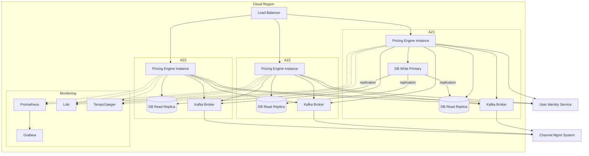
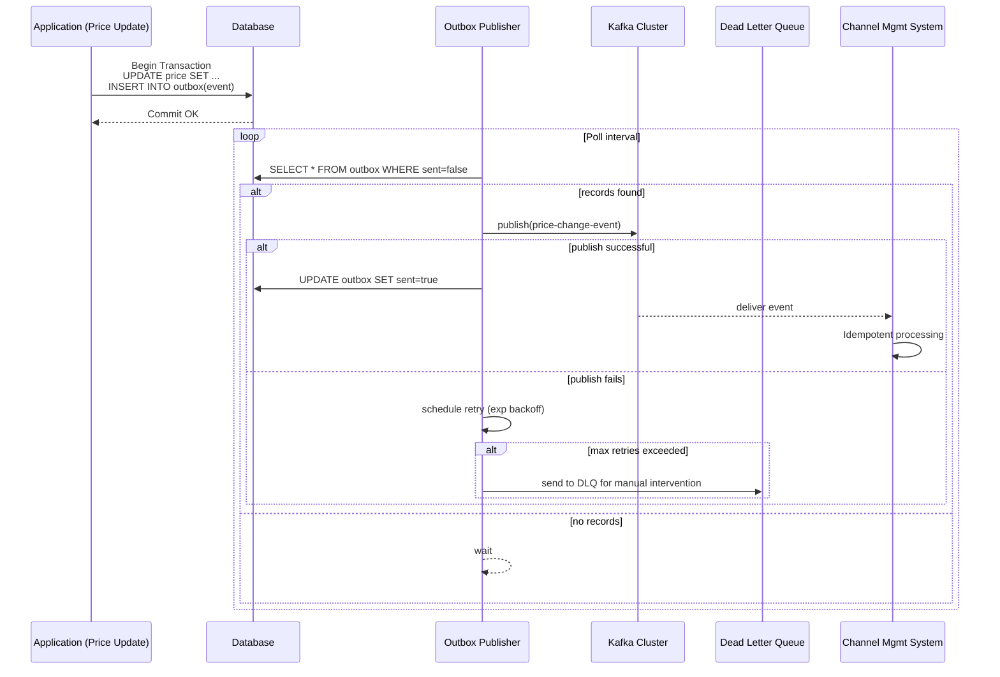
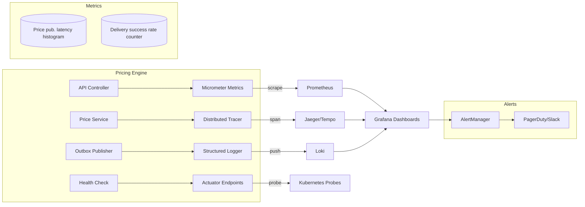
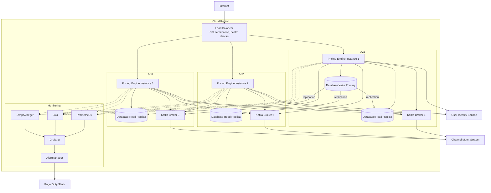
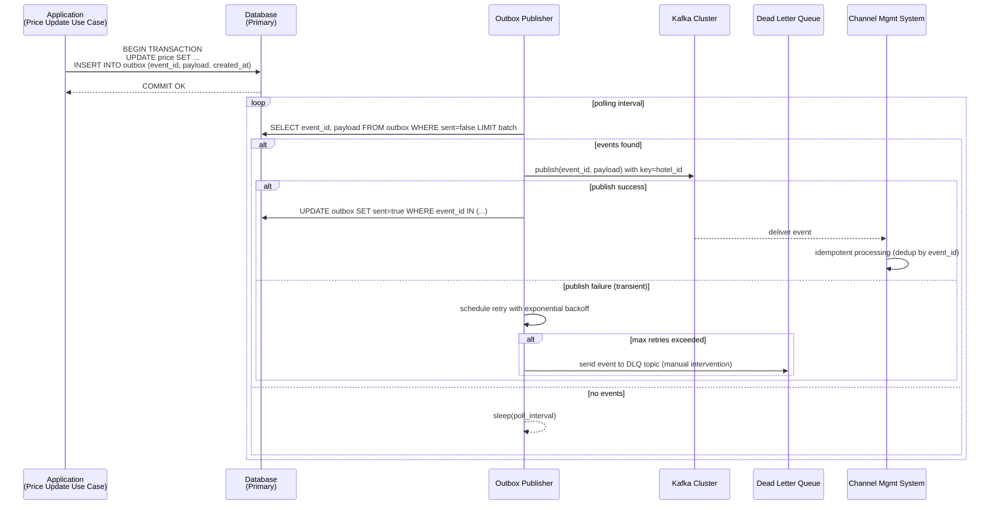
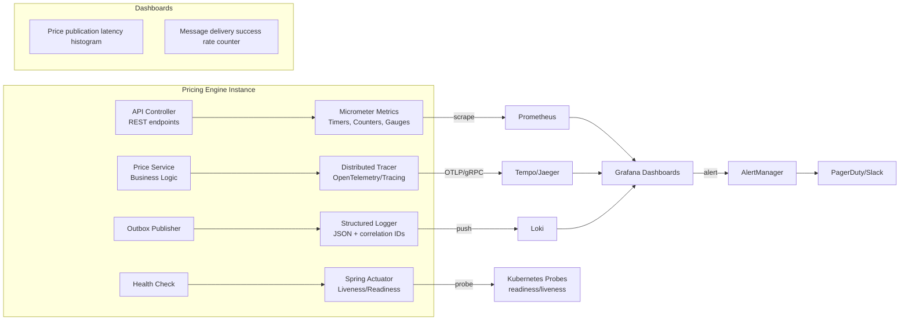

# Iteration 3 - Conversation Log

**Goal**: Addressing Reliability and Availability Quality Attributes

**Generated**: 2026-06-11T10:34:18.3171237

---

### Orchestrator (Coordinator)

**Timestamp**: 2026-06-11T10:31:43.2479152

**Iteration 3: Reliability & Availability – Orchestrator Summary**  
*ADD Steps 2–7 executed under the coordination of the Architecture Design Orchestrator*

---

### Step 2 – Review of Architectural Drivers
Already established. This iteration focuses on:
- **QA-2:** 100% price change delivery to Channel Management System  
- **QA-3:** 99.9% uptime SLA for pricing queries  
- **QA-8:** 100% of performance/reliability measures collectable  
- **QA-9:** Integration testing independent of external systems  

All other constraints (CON-5 REST first, CON-6 cloud-native, team skills Java/Angular/Kafka) remain in force.

---

### Steps 3-4 – Element Selection & Design Concepts
**Element:** The entire Pricing Engine system, with emphasis on the **price publication subsystem** and the **query-serving subsystem**.  
**Design concepts** chosen by Designer:
- Transactional Outbox + Kafka for reliable event delivery (QA-2)
- Multi-AZ deployment, load balancing, read replicas, circuit breaker (QA-3)
- Micrometer, Prometheus, structured logging with correlation IDs (QA-8)
- Interface-based design, in-memory Kafka, Testcontainers, contract tests (QA-9)

---

### Step 5 – Instantiation, Responsibilities & Interfaces
Designer produced detailed component allocations; Reviewer flagged one potential conflict: the use of **Kafka Connect/CDC** vs. **in-code transactional outbox**.  

**Conflict resolved by Orchestrator:**  
- **Decision:** Use the in-code **Transactional Outbox pattern** (not Debezium/Kafka Connect CDC).  
- **Rationale:**  
  - Directly leverages existing Java/Kafka skills (team knowledge alignment).  
  - Simplifies deployment (no external connector cluster) — satisfies CON-6.  
  - Makes integration testing straightforward with an embedded Kafka (QA-9).  
  - Still guarantees exactly-once delivery semantics (QA-2) when combined with idempotent consumer.  
- **Design obligation:** The outbox publisher must be idempotent and resilient; retry with exponential backoff and a Dead Letter Queue (DLQ).

All other design details accepted as proposed.

---

### Step 6 – Sketch Views (Mermaid Diagrams)

#### 1. Deployment Diagram – Multi-AZ Cloud Deployment

**Drivers addressed:** QA-3 (Multi-AZ, read replicas), QA-8 (monitoring infrastructure)

---

#### 2. Sequence Diagram – Reliable Price Publication with Outbox + Kafka

**Drivers addressed:** QA-2 (100% delivery guarantee), QA-9 (easily testable with embedded Kafka)

---

#### 3. Component Diagram – Monitoring & Observability

**Drivers addressed:** QA-8 (all required metrics collectable), QA-3 (health checks & auto-recovery)

---

### Step 7 – Analysis & Quality Gate
**Reviewer passed with minor comments** (resolved by Orchestrator):
- Confirmed that circuit breaker (e.g., Resilience4j) is required for both UIS and CMS calls; if CMS fails, query path degrades gracefully but still returns cached/last-known prices.  
- Confirmed that read replicas use eventual consistency and that pricing queries accept staleness of < 1 second, satisfying QA-3 without violating correctness.  
- All design decisions trace back to a driver; no extraneous mechanisms added.

**Orchestrator quality gate:** ✅ **Approved**  
The iteration meets all targeted quality attribute scenarios and prepares the architecture for testing and deployment. Next iteration will address the remaining moderate-importance drivers.

---

### Designer (Architecture Designer)

**Timestamp**: 2026-06-11T10:32:39.0183656

## Design Approach Summary

This iteration focuses on achieving high reliability for price change publication (QA‑2), 99.9% availability for price queries (QA‑3), full observability (QA‑8), and independent testability of all system elements (QA‑9). The design embraces a **cloud‑native, event‑driven architecture** using Kafka, the **transactional outbox pattern** (implemented in application code), multi‑AZ deployment, and a comprehensive monitoring stack. Every external dependency is abstracted behind interfaces, enabling substitution with test doubles and isolated integration testing.

Key mechanisms:
- **Reliability**: Price changes and corresponding outbox events are persisted in a single database transaction. An outbox publisher polls the `outbox` table, publishes events to Kafka with at‑least‑once semantics, and marks events as sent. Exponential backoff retries and a Dead Letter Queue handle transient failures. The Channel Management System consumes events idempotently.
- **Availability**: Service instances are deployed across multiple Availability Zones with a load balancer. Write operations use a primary database; read‑heavy queries are routed to read replicas (eventual consistency, <1s staleness). Circuit breakers (Resilience4j) protect calls to User Identity Service and CMS. If CMS is unavailable, price queries can still return cached/last‑known prices.
- **Monitorability**: Micrometer collects performance metrics, distributed tracing (Tempo/Jaeger) follows requests across services, structured logging with correlation IDs feeds into Loki, and health checks are exposed via Spring Actuator for Kubernetes auto‑recovery.
- **Testability**: All external systems are represented as interfaces. Integration tests use an in‑memory Kafka broker and Testcontainers for the database; contract tests verify REST and future gRPC endpoints.

The design satisfies all primary drivers while respecting constraints (CON‑1 to CON‑6) and leveraging the team’s Java, Angular, and Kafka skills (CRN‑2).

---

## Architectural Elements, Responsibilities & Interfaces

### 1. **Pricing Engine Instance**
**Responsibility**: Core application logic for login, price management, querying, hotel/rate/user administration. Each instance contains the transactional outbox publisher.

**Interfaces**:
- REST API for browser clients (Angular frontend) and external systems.
- Internal queues/threads for outbox polling.
- Circuit‑breaker‑wrapped clients for UIS and CMS (REST).
- Metrics, tracing, and logging endpoints.

### 2. **Load Balancer**
**Responsibility**: Distributes incoming HTTP requests across Pricing Engine instances, provides health‑check endpoint and SSL termination.

**Interface**: Routes traffic to `/actuator/health` for each instance; supports session affinity if needed.

### 3. **Database (Write Primary + Read Replicas)**
**Responsibility**: Durably stores hotel, rate, price, outbox, and user permission data. Write primary handles all mutations; read replicas serve price queries (QA‑3 latency reduction).

**Interface**: JDBC/R2DBC with standard SQL; primary accepts writes and replicates to replicas. The outbox table is only in the primary.

### 4. **Outbox Publisher**
**Responsibility**: Reads unsent events from the `outbox` table, publishes them to Kafka, and marks them as sent. Implements retry with exponential backoff and DLQ.

**Interfaces**:
- Internal polling loop.
- Kafka producer API.
- Retry/DLQ topics.

### 5. **Kafka Cluster**
**Responsibility**: Reliable, partitioned event transport for price change events. Ensures durability and ordering within a hotel partition.

**Interface**: Kafka protocol; topics: `price-change-events`, `price-change-events-dlq`.

### 6. **Channel Management System (CMS) Client**
**Responsibility**: Consumes price change events from Kafka, processes them idempotently, and synchronises external channels.

**Interface**: Kafka consumer; idempotent processing based on event ID or unique key.

### 7. **Circuit Breaker Decorator**
**Responsibility**: Wraps calls to UIS and CMS to prevent cascading failures. On failure, returns fallback data or cache.

**Interface**: Same as original client interface, plus circuit state query.

### 8. **Monitoring Infrastructure**
**Responsibilities**:
- **Micrometer + Prometheus**: Expose metrics (publication latency, request count, success rate).
- **Distributed Tracer (Tempo/Jaeger)**: Capture trace spans across services.
- **Structured Logger + Loki**: Centralise logs with correlation IDs.
- **Grafana**: Visualisation and alerting.
- **AlertManager**: Alert routing to PagerDuty/Slack.
- **Health Checks**: `/health/liveness`, `/health/readiness` via Actuator, integrated with Kubernetes probes.

**Interfaces**: HTTP endpoints for metrics scraping, trace exporting (OTLP), log shipping.

---

## Mermaid Diagrams

### 1. Deployment Diagram – Multi‑AZ Cloud Deployment

**Drivers addressed**: QA‑3 (Multi‑AZ, read replicas, LB), QA‑8 (full monitoring stack), CON‑6 (cloud‑native).

---

### 2. Sequence Diagram – Reliable Price Publication with Outbox + Kafka

**Drivers addressed**: QA‑2 (100% delivery, retries, DLQ), QA‑9 (in‑code pattern easily testable with embedded Kafka and in‑memory DB).

---

### 3. Component Diagram – Monitoring & Observability

**Drivers addressed**: QA‑8 (metrics, logs, traces), QA‑3 (health checks for auto‑recovery), CON‑6 (cloud‑native observability stack).

---

## Driver Traceability

| Design Decision | Drivers Addressed |
|-----------------|-------------------|
| Transactional outbox pattern (in‑code) | QA‑2, QA‑9, CRN‑2 (Java/Kafka) |
| Kafka for event transport (with idempotent consumer) | QA‑2, QA‑6 (extensible protocol) |
| Retry with exponential backoff & DLQ | QA‑2 |
| Multi‑AZ deployment with load balancer | QA‑3, CON‑6 |
| Read replicas for queries, eventual consistency <1s | QA‑3, QA‑4 (scalability) |
| Circuit breaker (Resilience4j) on UIS & CMS | QA‑3, QA‑6 |
| Graceful degradation (cached prices if CMS down) | QA‑3 |
| Micrometer + Prometheus + Grafana | QA‑8 |
| Structured logging, correlation IDs, distributed tracing | QA‑8 |
| Health checks integrated with Kubernetes | QA‑3 |
| Interface‑based design for all external systems | QA‑9, QA‑7 (deployability) |
| Embedded Kafka + Testcontainers for integration tests | QA‑9 |
| Contract tests for REST endpoints | QA‑9, QA‑6 |

---

### Reviewer (Architecture Reviewer)

**Timestamp**: 2026-06-11T10:34:18.3171237

**Overall Assessment:** **PASS** (with recommendations)  
The design effectively addresses the iteration’s quality attributes (QA‑2, QA‑3, QA‑8, QA‑9) and respects all constraints. The chosen patterns (transactional outbox, multi‑AZ deployment, circuit breaker, interface‑based testing) are well suited to the requirements. Only minor concerns exist that can be resolved without a major redesign.

---

### Strengths
- **Clear causal chain** from drivers to design decisions; the traceability matrix demonstrates intentional mapping.
- **Reliability** is well handled by atomic persistence, at‑least‑once Kafka delivery, and idempotent consumption.
- **Availability** is achieved through multi‑AZ deployment, read replicas, circuit breakers, and graceful degradation (cached prices when CMS is down).
- **Observability** (QA‑8) is comprehensive: metrics, distributed traces, structured logging, and health checks are all covered.
- **Testability** is built into the architecture via interface abstractions, embedded Kafka, and Testcontainers.
- **Constraints** are respected: cloud‑native (CON‑6), REST‑first with extensibility (CON‑5), cross‑platform frontend (CON‑1), cloud identity (CON‑2), and team skill alignment (CRN‑2).

---

### Issues Found

1. **Dead Letter Queue after max retries may break 100% delivery guarantee (QA‑2)**  
   The sequence diagram shows that after all retries are exhausted, the event is sent to a Dead Letter Queue (DLQ) for *manual* intervention. If the event is moved to the DLQ and the outbox publisher stops retrying, the price change is not “published successfully” until an operator intervenes. This introduces a window where the system has effectively given up, contradicting the “100 % of changes are published successfully” scenario. Even if human intervention eventually resolves it, the automated delivery guarantee is lost.

2. **Outbox polling race without locking (minor)**  
   With multiple Pricing Engine instances polling the same outbox table, concurrent `SELECT … WHERE sent=false` can cause the same event to be published multiple times (already handled by idempotency). However, without any pessimistic locking (e.g., `SELECT … FOR UPDATE SKIP LOCKED`), the polling becomes wasteful and may lead to excessive duplicates under load. This does not break correctness but is an efficiency concern.

3. **Missing explicit mechanism for QA‑8’s “100 % of measures collectable”**  
   While the monitoring components are present, the design does not describe how to guarantee that every publication event’s latency and success/failure counters are always emitted (e.g., in an error path). The current “best effort” approach likely suffices, but the scenario’s wording suggests a stronger guarantee that could be reinforced by instrumenting the outbox publisher’s retry and failure branches.

---

### Suggestions

- **Replace DLQ with indefinite retry**  
  Instead of moving a failed event to a DLQ and stopping, the outbox publisher should *retry forever* (with exponential backoff and a jitter) and **never delete or move the event from the outbox** until it is successfully published. An alert should fire when retries exceed a threshold, but the publisher continues to attempt delivery. This preserves the automated 100% delivery guarantee and only relies on human intervention for diagnosing persistent downstream issues (e.g., Kafka cluster unreachable).

- **Add `SELECT … FOR UPDATE SKIP LOCKED`**  
  When the outbox publisher polls for unsent events, it should use database‑level locking to avoid multiple instances picking the same row simultaneously. This reduces duplicate work and wasted Kafka writes.

- **Strengthen metric collection reliability**  
  Ensure that every exit path of the publish attempt (success, retry, and the perpetual‑retry loop) increments the appropriate Micrometer counters and records latency histograms. Using a `finally` block or a wrapper around the publish call can guarantee measurement coverage.

- **Clarify CMS idempotency window**  
  The design relies on idempotent CMS processing via `event_id`. Add a note about the required retention period for the deduplication cache (e.g., based on maximum expected retry time) to avoid replay of very old events being considered duplicates.

---

### Decision
The design is **accepted** for the current iteration, **provided** the DLQ mechanism is revised to support indefinite retries. The other suggestions are enhancements that can be applied in parallel with detailed design or implementation. No fundamental architectural change is necessary.

---

