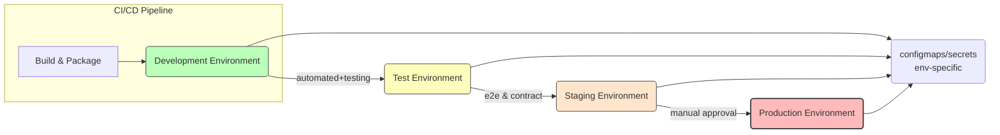
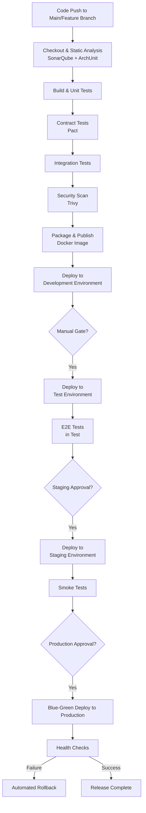
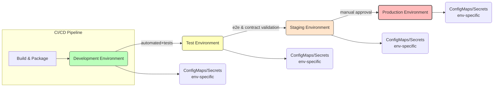
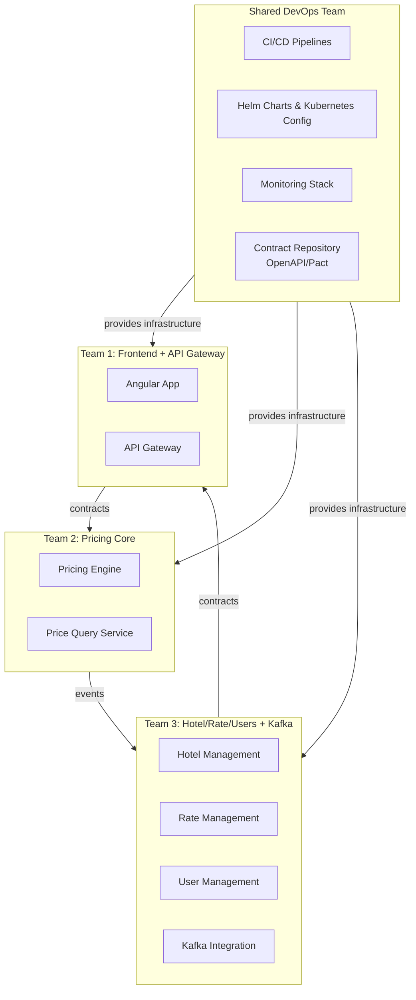

# Iteration 4 - Conversation Log

**Goal**: Addressing Development and Operations

**Generated**: 2026-06-11T10:37:48.6863887

---

### Orchestrator (Coordinator)

**Timestamp**: 2026-06-11T10:35:17.6341571

## Orchestration Actions

### Step 2: Establish Iteration Goal (confirmed)
**Designer focus:** This iteration will design the **Development and Operations Infrastructure** – the system’s deployment, CI/CD, work allocation, and quality guardrails.  
**Reviewer verification:** Ensure alignment with the previously agreed global architectural drivers (QA-7, CRN-3, CRN-4, CRN-5, CON-3, CON-4, QA-9) and that the scope satisfies the “Addressing Development and Operations” need.

### Step 3: Choose Element(s) to Refine
**Designer focus:** Refine the following cross-cutting elements as a cohesive “DevOps Subsystem”:  
- CI/CD pipeline stages and tools  
- Deployment environments and promotion flow  
- Container orchestration and configuration management  
- Team-to-component assignment and branching strategy  
**Reviewer verification:** The chosen elements collectively cover the lifecycle from code commit to production operation, and they are coherent.

### Step 4: Choose Architectural Drivers
**Designer focus:** Use the explicitly listed drivers. Bind each design decision to at least one driver.  
- **QA-7 (Deployability):** Environment portability without code changes  
- **QA-9 (Testability):** Integration testing  
- **CRN-3 (Work Allocation):** Team assignment  
- **CRN-4 (Avoid Technical Debt):** Enforced contracts, static analysis, fitness functions  
- **CRN-5 (Continuous Deployment):** Automated pipeline with blue-green deployment  
- **CON-3 (Git-based platform):** GitOps approach  
- **CON-4 (Delivery schedule):** 2-month MVP, 6-month full scope  
- **CON-5 (REST primary):** (implicit – API contracts for testing)  
- **CON-6 (Cloud-native):** Kubernetes, containers  
**Reviewer verification:** Every driver is addressed; no irrelevant drivers are forced in.

### Step 5: Design Element(s)
**Designer focus:** Produce concrete design decisions with rationale. I now summarize the decisions (which you will later diagram).

**Decision 1 – Containerization & Orchestration (QA-7, CON-6)**  
- All services packaged as Docker images.  
- Kubernetes as orchestration layer with Helm charts for deployment.  
- Environment‑specific configuration injected via ConfigMaps and Secrets – no code changes between environments.

**Decision 2 – CI/CD Pipeline (CRN-5, CON-3, QA-9)**  
- Git‑based pipeline using GitHub Actions (aligned with CON-3, team skills).  
- Stages:  
  1. Checkout & Static Analysis (SonarQube)  
  2. Build & Unit Tests  
  3. Contract Tests (Pact)  
  4. Integration Tests  
  5. Security Scan (Trivy)  
  6. Package & Publish Docker image  
  7. Deploy to Development (automatic on main branch)  
  8. Manual gate → Deploy to Test  
  9. Automated E2E tests on Test env → Deploy to Staging (with approval)  
  10. Blue‑Green deployment to Production (canary optional)  
  11. Automated rollback if health checks fail.  

**Decision 3 – Environment Layout (QA-7, CON-4)**  
- **Development:** Frequent, automatic deploys for integration testing.  
- **Test:** Used for contract and E2E testing; manual/automated promotion from Dev.  
- **Staging:** Production‑like, final validation before release.  
- **Production:** Blue‑green with instant rollback.  
- Promotion path: Dev → Test → Staging → Prod, gated by tests and approvals.

**Decision 4 – Team Allocation & Branching (CRN-3, CON-4)**  
- **Team 1 (Frontend + Gateway):** Main repository for Angular app and API Gateway; feature branches, PRs to main trigger pipeline.  
- **Team 2 (Pricing Engine + Price Query):** Own repo; same branching strategy.  
- **Team 3 (Hotel/Rate/User + Kafka):** Own repo; same strategy.  
- **Shared DevOps:** Maintains pipeline definitions, Helm charts, monitoring infrastructure in a shared repo.  
- MVP scope (2 months) delivered by teams 1 and 2 focusing on HPS‑1, HPS‑2, HPS‑3; Team 3 builds basic hotel/rate management with minimal Kafka. Full scope (6 months) adds all use cases.

**Decision 5 – Technical Debt Prevention (CRN-4)**  
- All inter‑service communication defined via **OpenAPI and Pact contracts** stored in a central contract repo.  
- Pipeline includes **architecture fitness functions** (e.g., ArchUnit for package dependencies, banned imports) and static analysis with SonarQube quality gates.  
- Automated contract testing in the pipeline ensures conformance.

**Reviewer verification:** Each decision is traceable to the drivers. The design satisfies environment portability, automated testing, team autonomy, and rapid delivery. No decisions conflict; the pipeline tool (GitHub Actions) respects CON-3 and team familiarity.

*(No conflict raised by Reviewer – accepted as is.)*

### Step 6: Sketch Views
**Designer focus:** Produce Mermaid diagrams that represent the DevOps subsystem design.  
**Reviewer verification:** Diagrams match the decisions, are readable, and cover all required viewpoints.

---

**Diagram 1 – CI/CD Pipeline Diagram**  
```mermaid
graph TD
    A[Code Commit to Main/Feature] --> B[Checkout & Static Analysis<br/>SonarQube]
    B --> C[Build & Unit Tests]
    C --> D[Contract Tests<br/>Pact]
    D --> E[Integration Tests]
    E --> F[Security Scan<br/>(Trivy)]
    F --> G[Package & Publish<br/>Docker Image]
    G --> H[Deploy to<br/>Development]
    H --> I{Manual Gate?}
    I -->|Yes| J[Deploy to Test]
    J --> K[E2E Tests<br/>in Test]
    K --> L{Staging Approval?}
    L -->|Yes| M[Deploy to Staging]
    M --> N[Smoke Tests]
    N --> O{Production Approval?}
    O -->|Yes| P[Blue-Green Deploy<br/>to Production]
    P --> Q[Health Checks]
    Q -->|Failure| R[Automated Rollback]
```

**Diagram 2 – Deployment Environment Diagram**  


**Diagram 3 – Team Allocation Diagram**  
```mermaid
graph TB
    subgraph Team1[Team 1: Frontend + API Gateway]
        fe[Angular App]
        gw[API Gateway]
    end
    
    subgraph Team2[Team 2: Pricing]
        pe[Pricing Engine]
        pq[Price Query Service]
    end
    
    subgraph Team3[Team 3: Hotel/Rate/Users + Kafka]
        hm[Hotel Management]
        rm[Rate Management]
        um[User Management]
        ka[Kafka Integration]
    end
    
    subgraph Shared[Shared DevOps]
        pl[CI/CD Pipelines]
        he[Helm Charts & K8s Config]
        mi[Monitoring Stack]
        co[Contract Repo<br/>(OpenAPI/Pact)]
    end
    
    Team1 --> |collaborates| Team2
    Team2 --> |events/messages| Team3
    Team3 --> |API contracts| Team1
    Shared --> |provides infra| Team1
    Shared --> |provides infra| Team2
    Shared --> |provides infra| Team3
```

### Step 7: Evaluate and Review
**Orchestrator final decision:** The design is coherent and fully addresses the iteration drivers.  
- Environment portability is ensured through containerization and external configuration.  
- Testability is built into every pipeline stage (unit, contract, integration, E2E).  
- Work allocation maps clearly to independent, cross‑functional teams with well‑defined interfaces.  
- Technical debt is prevented via automated quality gates and architecture fitness functions.  
- Continuous deployment infrastructure respects the Git‑based constraint and supports the 2‑month MVP timeline by enabling rapid, automated deliveries.  

**Quality Gate passed – Iteration 4 design is approved.**

---

### Designer (Architecture Designer)

**Timestamp**: 2026-06-11T10:36:04.0280112

## Iteration 4: Development and Operations Infrastructure – Design

### Design Summary
This iteration defines a **cloud‑native DevOps subsystem** that enables rapid, safe, and team‑aligned delivery of the Hotel Pricing System. The design satisfies all assigned drivers (QA‑7, QA‑9, CRN‑3, CRN‑4, CRN‑5, CON‑3, CON‑4, CON‑6) through:

- **Deployability (QA‑7)**: Docker containers, Kubernetes orchestration, Helm charts, and externalised configuration (ConfigMaps/Secrets) – no code changes across Development, Test, Staging, and Production.
- **Testability (QA‑9)**: Automated pipelines with unit, contract, integration, and end‑to‑end test stages, plus architecture fitness functions.
- **Work Allocation (CRN‑3)**: Three cross‑functional teams (Frontend+Gateway, Pricing Core, Hotel/Rate/Users+Kafka) mapped to independent repositories, with a shared DevOps team owning pipeline, charts, and monitoring.
- **Technical Debt Prevention (CRN‑4)**: Enforced inter‑service contracts (OpenAPI/Pact), static analysis (SonarQube), and architectural conformance tests (ArchUnit) as quality gates inside the pipeline.
- **Continuous Deployment (CRN‑5)**: A Git‑based CI/CD pipeline (GitHub Actions) with automated promotion through environments, blue‑green production deployment, and automated rollback.
- **Git‑based platform (CON‑3)**: Every artefact (code, config, contracts, pipeline definitions) is stored in Git repositories; all changes are managed through pull requests and protected branches.
- **Delivery schedule (CON‑4)**: The pipeline and team assignment support a 2‑month MVP (HPS‑1, HPS‑2, HPS‑3) and progressive delivery of the full scope in 6 months.
- **Cloud‑native (CON‑6)**: Containerisation with Kubernetes and GitOps‑style configuration management.

---

### Architectural Views

#### 1. CI/CD Pipeline Diagram


#### 2. Deployment Environment Diagram


#### 3. Team Allocation Diagram


---

### Architectural Elements, Responsibilities, and Interfaces

| Element | Responsibility | Interfaces / Artefacts | Driven By |
|---------|---------------|------------------------|-----------|
| **CI/CD Pipeline (GitHub Actions)** | Automate build, test, security scan, packaging, and deployment. Enforce quality gates. | Triggers on push to protected branches; consumes Dockerfiles, Helm charts, and contract definitions; publishes Docker images and deployment manifests. | CRN‑5, CON‑3, QA‑9, CRN‑4 |
| **Static Analysis & Architecture Fitness** | Validate code quality, banned dependencies, and architectural constraints. | SonarQube reports, ArchUnit rules. Fails build if quality gate not met. | CRN‑4 |
| **Unit & Integration Test Stage** | Run isolated and component‑level tests. | Junit, Mockito, Spring Test; output test reports. | QA‑9 |
| **Contract Test Stage (Pact)** | Ensure service interfaces conform to agreed contracts. | Pact files stored in contract repository; validates producer/consumer compatibility. | QA‑9, CRN‑4 |
| **Security Scan (Trivy)** | Detect vulnerabilities in dependencies and container images. | Scan reports; blocks promotion if critical vulnerabilities found. | CRN‑4 |
| **Docker Image Creation & Repository** | Package services as immutable, environment‑agnostic containers. | Dockerfile, image pushed to private registry. | QA‑7, CON‑6 |
| **Helm Charts & Kubernetes Config** | Define deployment descriptors; inject environment‑specific values. | Helm templates, values files, ConfigMaps, Secrets – stored in Git (GitOps). | QA‑7, CON‑6 |
| **Development Environment** | Fast feedback for developers; automatic deployment after successful build. | Kubernetes namespace, ephemeral databases; receives every successful push to main. | QA‑7, QA‑9 |
| **Test Environment** | Execute end‑to‑end and contract testing against realistic APIs and integrations. | Stable Kubernetes namespace; seeded data; promoted from Dev. | QA‑9 |
| **Staging Environment** | Production‑like validation; final smoke tests. | Mirrors Production configuration; manual approval gate. | QA‑7, CON‑4 |
| **Production Environment** | Live system; high‑availability deployment with zero‑downtime rollout. | Blue‑green slots behind load balancer; automated health checks and rollback. | QA‑7, CON‑6, QA‑3 |
| **Team 1 Repository** | Angular app and API Gateway code, tests, Dockerfile, own pipeline definition (extended from shared). | Exposes REST/WebSocket to UI; consumes REST from downstream services. | CRN‑3, CON‑4 |
| **Team 2 Repository** | Pricing Engine and Price Query Service code, tests, etc. | Provides pricing APIs; publishes events to Kafka. | CRN‑3, CON‑4 |
| **Team 3 Repository** | Hotel, Rate, User Management services and Kafka integration. | Provides management APIs; consumes pricing events. | CRN‑3, CON‑4 |
| **Shared DevOps Repository** | Pipeline templates, Helm charts, monitoring stack, contract definitions. | Used by all teams via submodules or references. | CRN‑3, CRN‑5, QA‑7, CRN‑4 |

---

### Rationale Traceability

Every design decision directly addresses one or more of the iteration’s drivers:

- **QA‑7 – Deployability**: Docker and Kubernetes decouple the application from any environment‑specific runtime. Helm charts and external configuration (ConfigMaps/Secrets) ensure that the same image flows from Dev to Prod without modification.
- **QA‑9 – Testability**: The pipeline incorporates unit, contract, integration, and E2E tests, guaranteeing that each service can be verified independently. Contract testing (Pact) validates isolated service contracts without relying on live external systems.
- **CRN‑3 – Work Allocation**: Three self‑contained teams each own a dedicated repository containing their service code, tests, and CI definition. This minimises inter‑team dependencies, allows independent release cadences, and supports the MVP delivery strategy.
- **CRN‑4 – Avoid Technical Debt**: Architecture fitness functions (ArchUnit) run on every build to uphold package structure and dependency rules. Static analysis (SonarQube with strict quality gates) prevents code quality erosion. Enforcing OpenAPI/Pact contracts makes integration drift impossible without breaking the pipeline.
- **CRN‑5 – Continuous Deployment Infrastructure**: The GitHub Actions pipeline fully automates the path from commit to production, with appropriate manual approval gates for upper environments. Blue‑green deployment and automated rollback reduce the risk of bad releases reaching end users.
- **CON‑3 – Git‑based Platform**: All assets—source code, pipeline definitions, Helm charts, contracts, and configuration—are version‑controlled in Git. This fits the organisation’s existing tooling and enables a GitOps workflow.
- **CON‑4 – 2‑Month MVP / 6‑Month Full Scope**: The team allocation allows Teams 1 and 2 to deliver the MVP use cases quickly, while Team 3 can build the remaining management services in parallel. The pipeline’s automated promotion reduces the overhead of releasing incremental features.
- **CON‑6 – Cloud‑Native Approach**: Containerisation, Kubernetes orchestration, externalised configuration, and the GitOps model follow standard cloud‑native practices, enabling elastic scaling and resilience.

The design is cohesive: all elements reinforce the ability to deliver reliably, test thoroughly, avoid technical debt, and scale team contributions effectively.

---

### Reviewer (Architecture Reviewer)

**Timestamp**: 2026-06-11T10:37:48.6863887

# Architecture Review – Iteration 4: Development and Operations Infrastructure

**Reviewer:** Architecture Quality Reviewer Agent  
**Date:** 2026-06-11  
**Iteration Goal:** Addressing Development and Operations  
**Reviewed Drivers:** QA-7, QA-9, CRN-3, CRN-4, CRN-5, CON-3, CON-4, CON-6  

---

## Overall Assessment: **PASS**  
The design is coherent, well‑traced to the assigned drivers, and provides a solid cloud‑native DevOps foundation. Minor gaps related to operational detail (database migrations, configuration management) should be addressed before implementation to avoid technical debt and deployment friction.

---

## Strengths
- **Clear Rationale Traceability:** Every decision is explicitly linked to one or more drivers, making verification straightforward.
- **Strong Technical Debt Prevention:** The pipeline enforces static analysis, architecture fitness functions (ArchUnit), and contract testing (Pact) as quality gates – this directly fulfills CRN‑4.
- **Environment Portability (QA‑7):** Docker, Kubernetes, Helm, and externalised configuration (ConfigMaps/Secrets) ensure that the same immutable image travels from Dev to Prod without code changes.
- **Comprehensive Testing Pyramid (QA‑9):** Unit, contract, integration, and end‑to‑end tests are all built into the pipeline, and contract testing allows independent verification of services.
- **Effective Work Allocation (CRN‑3):** Three independent, cross‑functional teams each own a repository with clear interfaces (contracts, events) and can extend the shared CI/CD templates; this minimises inter‑team dependencies and supports parallel development.
- **Production‑Grade Delivery (CRN‑5, CON‑6):** Blue‑green deployment, automated rollback, and GitOps‑style configuration management embody cloud‑native best practices.

---

## Issues Found

### 1. **Missing Database Schema Migration Strategy**  
The pipeline contains no step for applying or verifying database schema changes. The Hotel Pricing System will rely on persistent data (hotels, rates, prices). Without automated migration handling, promoting a new release may fail because the database schema is out of sync, and test environments may not reflect the required schema.  
**Impacted Drivers:** QA‑7 (Deployability), CRN‑4 (Technical debt)  
**Suggestion:** Insert a **migration job** (e.g., Flyway, Liquibase) as part of the deployment stage – before the new version becomes active in any environment. Integrate it into the same automated flow, and make it a hard gate in the pipeline. In Dev, migrations can run automatically; in higher environments, they should be tested for idempotency and reversibility.

### 2. **Configuration Management Detail Lacking**  
The design states that *ConfigMaps/Secrets* are env‑specific, but does not specify where they are stored, versioned, or how the pipeline selects the correct values. A true GitOps workflow requires that all configuration be declarative and version‑controlled.  
**Impacted Drivers:** QA‑7, CRN‑5  
**Suggestion:** Clarify that environment‑specific values are kept in **Helm chart value files** (e.g., `values-dev.yaml`, `values-prod.yaml`) inside the Shared DevOps repository. The pipeline should pass the `--values` flag accordingly. Secrets should be encrypted (e.g., via Sealed Secrets or a vault tool) and stored in Git, with access controls.

### 3. **Test Environment Data Seeding Strategy Omitted**  
The Test environment is described as having *“seeded data”*, but there is no mechanism for resetting or maintaining that data between test runs. If E2E and integration tests modify state, subsequent runs may become non‑deterministic or fragile.  
**Impacted Driver:** QA‑9 (Testability)  
**Suggestion:** Include a **data reset step** before the main test cycle, e.g., run database restore scripts or ephemeral database clones that are discarded after the test suite finishes. This can be orchestrated by the pipeline job.

### 4. **Pipeline Diagram Minor Ambiguity**  
The CI/CD Pipeline diagram uses decision nodes (*Manual Gate?*, *Staging Approval?*, *Production Approval?*) without an explicit “No” branch. Readers may assume the pipeline continues or terminates ambiguously.  
**Suggestion:** Add a “No → Reject / Notify” branch to each decision to clearly indicate that the promotion stops until the issue is resolved.

### 5. **MVP Feasibility – Cross‑Team Data Dependencies**  
The MVP scope (HPS‑1, HPS‑2, HPS‑3) is allocated to Teams 1 and 2, but price queries (HPS‑3) typically require hotel metadata, which is owned by Team 3 (Hotel Management). The design does not specify how this dependency is resolved early enough to avoid blocking the MVP.  
**Impacted Driver:** CON‑4 (2‑month MVP)  
**Suggestion:** Either define a **minimal stub/hard‑coded hotel endpoint** provided by Team 3 from Day 1, or agree on a static contractual dataset that Team 1/2 can use until the full service is ready. This keeps the MVP schedule viable.

---

## Suggestions (Non‑Blocking Improvements)
- **Monitoring Integration (QA‑8):** Although not a primary driver, the Shared DevOps team includes a Monitoring Stack. It would be beneficial to define how the pipeline feeds deployment events and health‑check results into that stack for traceability.
- **Security Scanning Scope:** Trivy scans cover containers and dependencies. Consider adding **SAST** (Static Application Security Testing) earlier in the pipeline for source‑code level vulnerabilities (e.g., using CodeQL or similar).
- **Immutable Infrastructure:** Emphasise that no in‑place updates are made to running environments; every change triggers a fresh Helm release, reinforcing GitOps principles.

---

## Decision: **Design Acceptable with Minor Modifications Required**  
The design adequately satisfies all assigned architectural drivers. The four main issues (migration strategy, configuration management, test data seeding, and pipeline diagram clarity) are operational refinements that should be addressed before the DevOps subsystem is implemented. Once these are incorporated, the design can move to the next stage.

**Recommended Action:** Designer revises the design notes to include the suggested mechanisms and confirms the changes with the reviewer. No iteration restart is needed.

---

