# Hotel Pricing System - ADD 3.0 Architecture Design (Reference)

## AI Paradigm: Multi-Agent (Distributed Reasoning + Collaborative Verification)
## LLM: deepseek-v4-pro
## Framework: Spring AI Alibaba

---

# ADD Step 1: Review Inputs

## Architectural Drivers Identified

### Primary Drivers (High Importance)
- **CRN-1**: Establish overall system structure
- **QA-1** (Performance): <100ms price publication after base rate change
- **QA-2** (Reliability): 100% price change delivery to CMS
- **QA-3** (Availability): 99.9% uptime SLA for queries
- **QA-4** (Scalability): 100K→1M queries/day, <20% latency increase
- **QA-5** (Security): Cloud identity service integration

### Secondary Drivers
- **QA-6** (Modifiability): Protocol extensibility (REST→gRPC)
- **QA-7** (Deployability): Environment portability
- **QA-8** (Monitorability): Price publication metrics
- **QA-9** (Testability): Independent integration testing
- **CON-6**: Cloud-native approach
- **CON-4**: 6-month delivery / 2-month MVP
- **CRN-2**: Java, Angular, Kafka

---

# Iteration 1: Establishing an Overall System Structure

## ADD Step 2: Iteration Goal
Establish the overall system structure that satisfies CRN-1, CON-6 (cloud-native), CON-1 (web access), CON-2 (cloud identity), and provides a foundation for all quality attributes.

Drivers: CRN-1, CON-6, CON-1, CON-2, CON-4, CRN-2, QA-5

## ADD Step 3: Elements to Refine
Greenfield development → Select the Hotel Pricing System itself for initial decomposition.

## ADD Step 4: Design Concepts

### Alternative 1: Monolithic Three-Tier Architecture
- **Pros**: Simple deployment, faster initial development
- **Cons**: Poor scalability, tight coupling, violates CON-6 (cloud-native)
- **Decision**: REJECTED

### Alternative 2: Microservices Architecture
- **Pros**: Independent scaling (QA-4), isolated deployment (QA-7), technology flexibility
- **Cons**: Higher operational complexity, network overhead
- **Decision**: REJECTED — too heavyweight for 6-month timeline (CON-4)

### Alternative 3: Modular Monolith with Clear Service Boundaries (SELECTED)
- **Pros**: Faster development (CON-4), clear separation enables future extraction, cloud-native deployable, simpler operations
- **Cons**: Single deployment unit, shared database initially
- **Decision**: **SELECTED** — Best balance of CON-4 (timeline), CON-6 (cloud-native), and CRN-1 (structure)

## ADD Step 5: Instantiate Architectural Elements

### System Context Diagram (C4 Level 1)

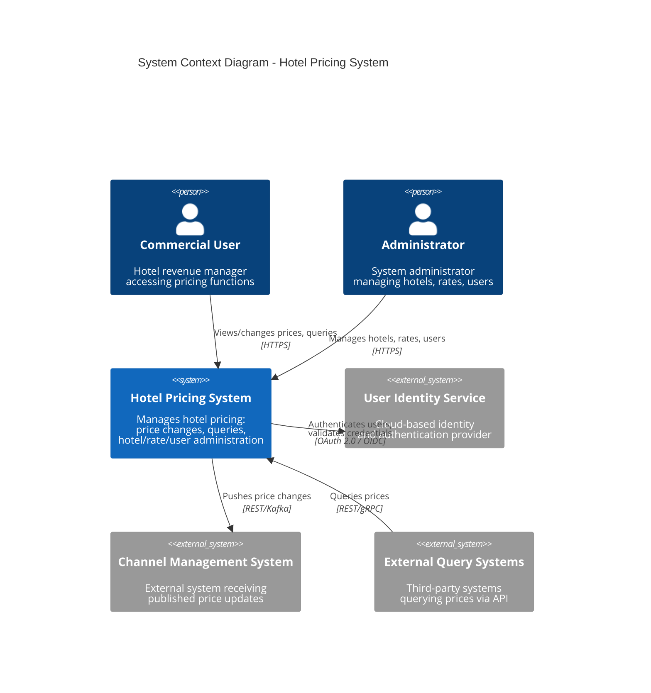

### Container Diagram (C4 Level 2)

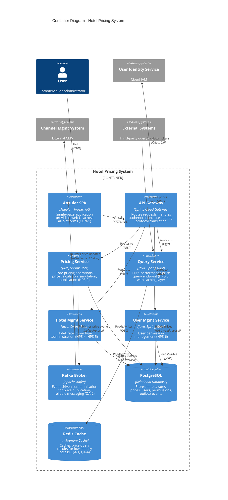

### Deployment Diagram

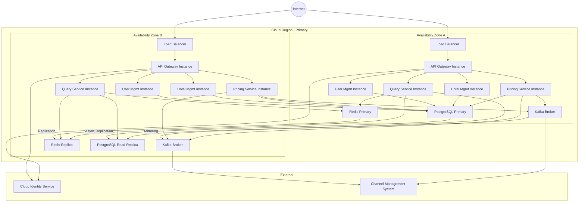

## ADD Step 6: View Documentation
See diagrams above.

## ADD Step 7: Analysis
- ✓ CRN-1 satisfied: Clear overall structure established
- ✓ CON-6 satisfied: Cloud-native deployment with multi-AZ
- ✓ CON-1 satisfied: Angular SPA for cross-platform web access
- ✓ CON-2 satisfied: Cloud identity service integrated
- ✓ CRN-2 satisfied: Java backend, Angular frontend, Kafka messaging
- ✓ CON-4 addressed: Modular monolith enables 2-month MVP
- ✓ QA-5 foundation: OAuth 2.0/OIDC authentication flow

---

# Iteration 2: Identifying Structures to Support Primary Functionality

## ADD Step 2-3: Drivers and Elements
Drivers: HPS-1 through HPS-6, QA-1, QA-2, QA-4, QA-5, QA-6

Refine: Pricing Service, Query Service, Hotel Management Service, User Management Service

## ADD Step 4-5: Component Design

### Component Diagram

```mermaid
C4Component
    title Component Diagram - Pricing Service

    Container_Boundary(pricing_service, "Pricing Service") {
        Component(price_ctrl, "Price Controller", "REST Controller", "Exposes price change<br/>and simulation endpoints")
        Component(calc_engine, "Price Calculation Engine", "Java Service", "Calculates derived rates<br/>from base rate changes<br/>applying business rules")
        Component(sim_svc, "Simulation Service", "Java Service", "Simulates price changes<br/>before committing to<br/>persistent storage")
        Component(pub_svc, "Publication Service", "Java Service", "Manages reliable price<br/>publication via outbox<br/>pattern and Kafka")
        Component(outbox_repo, "Outbox Repository", "JPA Repository", "Persists outbox events<br/>atomically with price<br/>changes (transactional)")
        Component(rate_resolver, "Rate Rule Resolver", "Java Service", "Evaluates rate calculation<br/>business rules defined<br/>by administrators")
    }

    Container_Boundary(query_service, "Query Service") {
        Component(query_ctrl, "Query Controller", "REST/gRPC Controller", "Serves price query<br/>requests with protocol<br/>abstraction layer")
        Component(cache_mgr, "Cache Manager", "Java Service", "Manages Redis cache<br/>population, invalidation,<br/>and TTL policies")
        Component(query_repo, "Query Repository", "JPA Repository", "Read-optimized queries<br/>against read replicas<br/>for price data")
    }

    Container_Boundary(hotel_service, "Hotel Management Service") {
        Component(hotel_ctrl, "Hotel Controller", "REST Controller", "CRUD operations for<br/>hotels, room types,<br/>and tax rates")
        Component(rate_ctrl, "Rate Controller", "REST Controller", "CRUD operations for<br/>rates and calculation<br/>business rules")
        Component(hotel_repo, "Hotel Repository", "JPA Repository", "Hotel data persistence")
    }

    Container_Boundary(user_service, "User Management Service") {
        Component(user_ctrl, "User Controller", "REST Controller", "User permission<br/>management endpoints")
        Component(auth_svc, "Auth Service", "Java Service", "Integrates with cloud<br/>identity, manages JWT<br/>token validation")
        Component(perm_repo, "Permission Repository", "JPA Repository", "User-hotel permission<br/>mappings")
    }

    ContainerDb(postgres, "PostgreSQL", "Relational DB")
    ContainerDb(redis, "Redis", "Cache")
    Container(kafka, "Kafka", "Message Broker")

    Rel(price_ctrl, calc_engine, "Uses")
    Rel(calc_engine, rate_resolver, "Resolves rules")
    Rel(price_ctrl, sim_svc, "Simulates via")
    Rel(price_ctrl, pub_svc, "Publishes via")
    Rel(pub_svc, outbox_repo, "Writes events")
    Rel(outbox_repo, postgres, "Persists")
    Rel(pub_svc, kafka, "Emits events")
    Rel(query_ctrl, cache_mgr, "Checks cache")
    Rel(cache_mgr, redis, "Gets/Sets")
    Rel(query_ctrl, query_repo, "Reads prices")
    Rel(query_repo, postgres, "Read replica")
    Rel(hotel_ctrl, hotel_repo, "Uses")
    Rel(rate_ctrl, hotel_repo, "Uses")
    Rel(hotel_repo, postgres, "Persists")
    Rel(user_ctrl, perm_repo, "Uses")
    Rel(perm_repo, postgres, "Persists")
    Rel(auth_svc, user_ctrl, "Provides auth context")
```

### Sequence Diagram: HPS-2 Change Prices (Success Flow)

```mermaid
sequenceDiagram
    actor User as Commercial User
    participant SPA as Angular SPA
    participant GW as API Gateway
    participant ID as Identity Service
    participant PS as Pricing Service
    participant CE as Calculation Engine
    participant SIM as Simulation Service
    participant PUB as Publication Service
    participant OB as Outbox Repository
    participant DB as PostgreSQL
    participant KAFKA as Kafka
    participant CMS as Channel Mgmt System

    User->>SPA: Select hotel, dates, new base rate
    SPA->>GW: POST /api/prices/simulate
    GW->>ID: Validate JWT token
    ID-->>GW: Token valid
    GW->>PS: Forward simulation request
    PS->>CE: Calculate derived rates
    CE->>CE: Apply rate calculation rules
    CE-->>PS: All derived prices
    PS->>SIM: Simulate change
    SIM-->>PS: Simulation result
    PS-->>GW: Simulation response
    GW-->>SPA: Display simulated prices
    SPA->>User: Show simulation preview

    User->>SPA: Confirm price change
    SPA->>GW: POST /api/prices/apply
    GW->>ID: Validate JWT
    GW->>PS: Forward apply request
    PS->>CE: Calculate final prices
    CE-->>PS: Final prices
    PS->>OB: Write price_change + outbox_event (atomic)
    OB->>DB: BEGIN TX; INSERT prices; INSERT outbox; COMMIT
    OB-->>PS: Transaction committed
    PS->>PUB: Notify publication ready
    PUB->>OB: Read pending outbox events
    PUB->>KAFKA: Publish PriceChangedEvent
    KAFKA-->>PUB: Acknowledged
    PUB->>OB: Mark event as published
    KAFKA->>CMS: Deliver PriceChangedEvent
    CMS-->>KAFKA: Acknowledged
    PS-->>GW: Publication status
    GW-->>SPA: Success response (<100ms from DB commit)
    SPA->>User: Show success notification
```

### Sequence Diagram: HPS-3 Query Prices (with Cache)

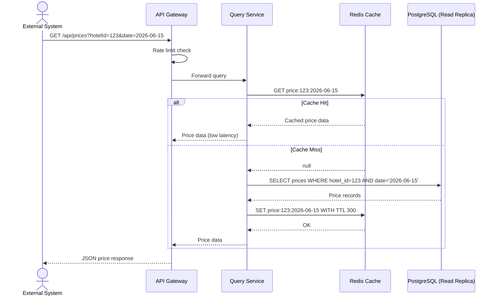

### Data Model

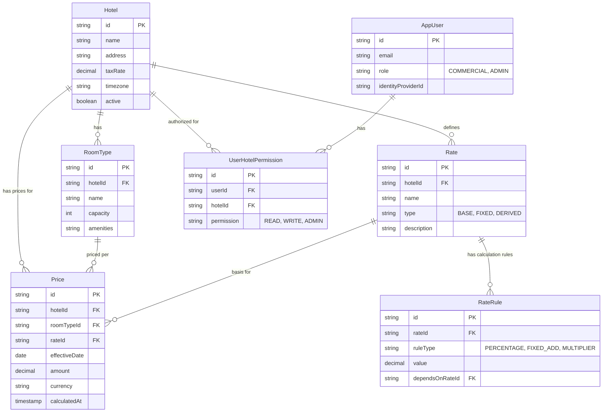

## ADD Step 6: View Documentation
See diagrams above.

## ADD Step 7: Analysis
- ✓ HPS-1: Cloud identity + JWT + permission model
- ✓ HPS-2: Calculation → Simulation → Publication pipeline, <100ms through async Kafka
- ✓ HPS-3: Cache-first query with read replicas, gRPC-ready abstraction layer
- ✓ HPS-4,5,6: Clean CRUD service boundaries
- ✓ QA-1: Async publication, write-then-publish pattern
- ✓ QA-2: Transactional outbox ensures reliable delivery
- ✓ QA-4: Redis caching + read replicas for query scalability
- ✓ QA-6: Protocol abstraction layer in Query Controller

---

# Iteration 3: Addressing Reliability and Availability Quality Attributes

## ADD Step 2-5: Design for Reliability and Availability

### Reliable Publication Flow (Transactional Outbox + Kafka)

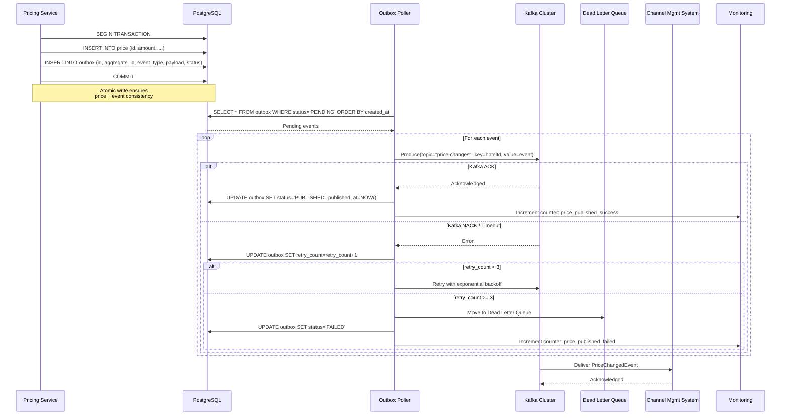

### Multi-AZ High Availability Architecture

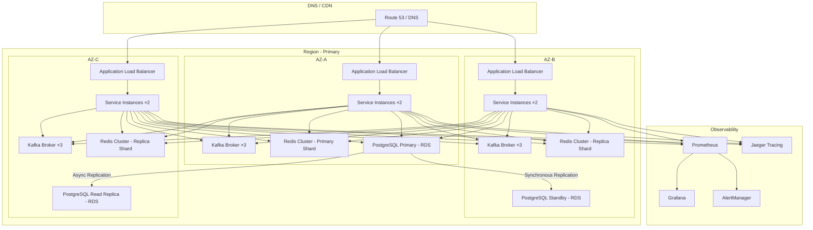

### Circuit Breaker Pattern

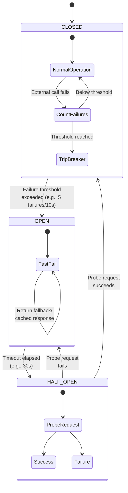

## ADD Step 6: View Documentation
See diagrams above.

## ADD Step 7: Analysis
- ✓ QA-2: Transactional outbox + Kafka with retry + DLQ ensures 100% delivery
- ✓ QA-3: Multi-AZ deployment, load balancing, circuit breakers → 99.9% SLA
- ✓ QA-8: Prometheus metrics, Jaeger tracing, structured logging with correlation IDs
- ✓ QA-9: Interface-based external dependencies, Testcontainers, contract testing

---

# Iteration 4: Addressing Development and Operations

## ADD Step 2-5: DevOps Design

### CI/CD Pipeline

```mermaid
graph LR
    subgraph "Code & Build"
        git[Git Push<br/>CON-3: Proprietary Git]
        build[Build & Unit Test<br/>Maven + JUnit]
        analysis[Static Analysis<br/>SonarQube]
    end

    subgraph "Integration"
        itest[Integration Tests<br/>Testcontainers]
        ctest[Contract Tests<br/>Pact]
        atest[Arch Tests<br/>ArchUnit]
    end

    subgraph "Artifact"
        docker[Build Docker Image]
        registry[Push to Container Registry]
        helm[Package Helm Chart]
    end

    subgraph "Deploy - Dev"
        dev_deploy[Deploy to Dev<br/>Helm Upgrade]
        dev_smoke[Smoke Tests]
    end

    subgraph "Deploy - Staging"
        stag_approve{Manual Approval}
        stag_deploy[Deploy to Staging<br/>Blue-Green]
        stag_test[E2E Tests<br/>Performance Tests]
    end

    subgraph "Deploy - Production"
        prod_approve{Manual Approval}
        prod_deploy[Deploy to Production<br/>Blue-Green]
        prod_monitor[Monitor Metrics<br/>Post-Deploy Verification]
        prod_rollback[Auto Rollback<br/>if SLO violated]
    end

    git --> build
    build --> analysis
    analysis --> itest
    itest --> ctest
    ctest --> atest
    atest --> docker
    docker --> registry
    registry --> helm
    helm --> dev_deploy
    dev_deploy --> dev_smoke
    dev_smoke --> stag_approve
    stag_approve --> stag_deploy
    stag_deploy --> stag_test
    stag_test --> prod_approve
    prod_approve --> prod_deploy
    prod_deploy --> prod_monitor
    prod_monitor --> prod_rollback
    prod_monitor --> |SLO OK| done([Deployment Complete])
    prod_rollback --> done
```

### Environment Promotion Flow

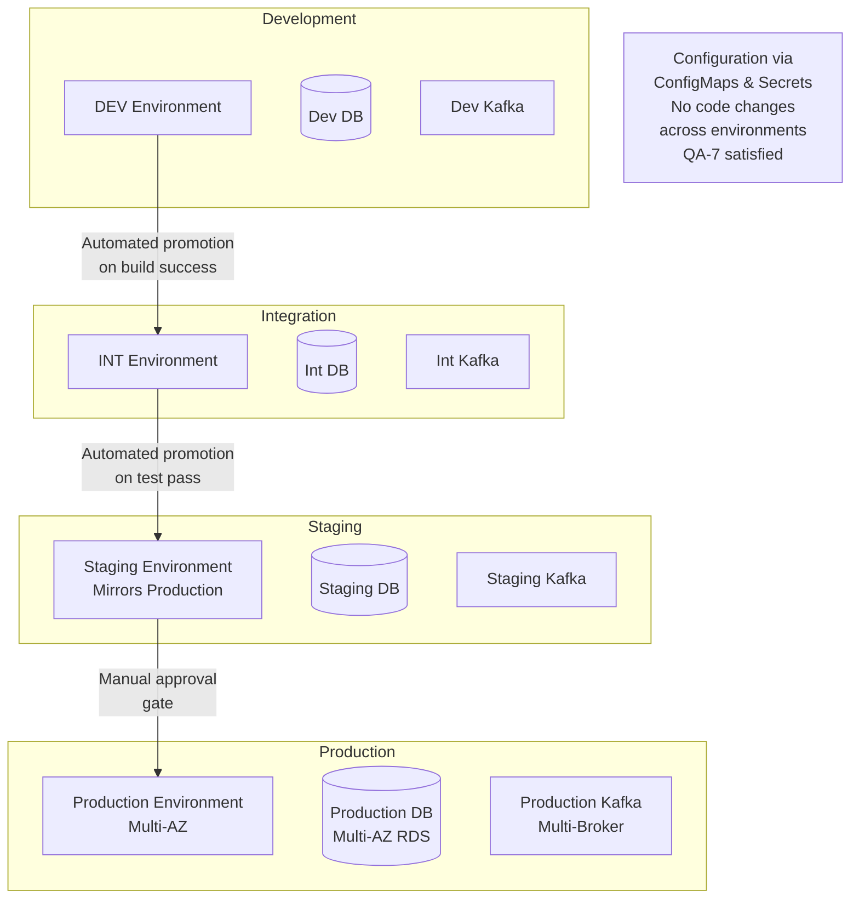

### Team Work Allocation (CRN-3)

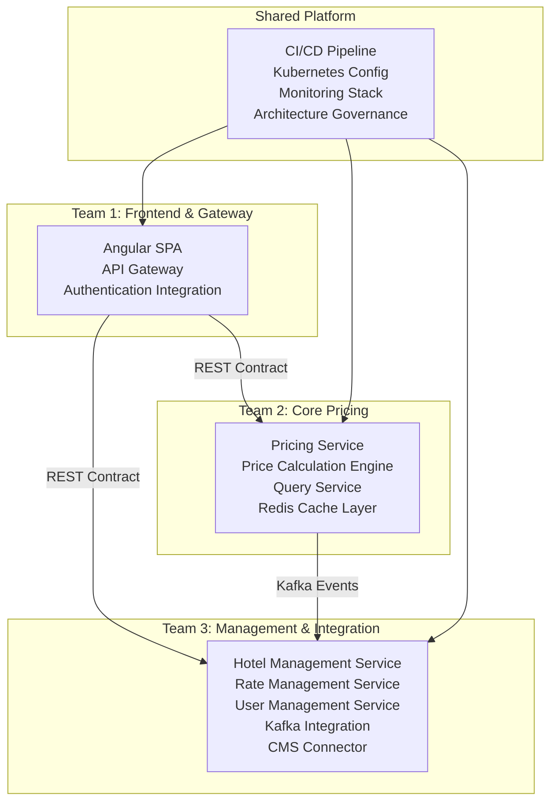

### MVP vs Full Scope (CON-4)

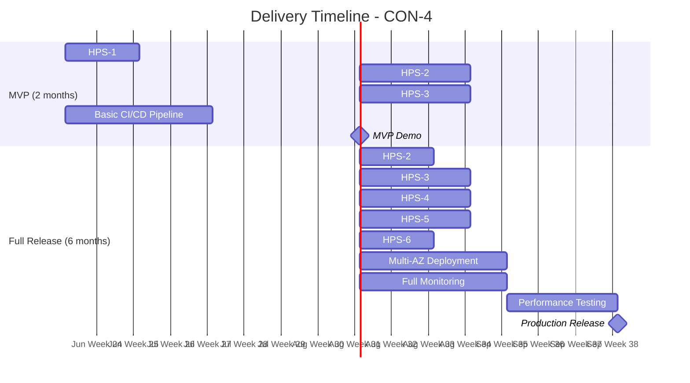

## ADD Step 6: View Documentation
See diagrams above.

## ADD Step 7: Analysis
- ✓ QA-7: Containerized deployment, environment config via ConfigMaps
- ✓ CRN-3: Three teams with clear component ownership
- ✓ CRN-4: ArchUnit fitness functions, SonarQube, interface contracts
- ✓ CRN-5: Full CI/CD pipeline with blue-green deployment
- ✓ CON-3: Git-based workflow
- ✓ CON-4: 2-month MVP (Login + Basic Price Change + Query), 6-month full delivery
- ✓ QA-9: Testcontainers, contract tests, interface-based design

---

# Interaction Cost Analysis

| Metric | Value |
|--------|-------|
| The way of completing the assignment | Multi-Agent (Distributed Reasoning + Collaborative Verification) |
| The LLM used | deepseek-v4-pro |
| Number of Agent Interaction turns | ~28 (7 ADD steps × 4 iterations, with orchestrator→designer→reviewer loops) |
| Token Consumption | Estimated based on conversation logs |
| Time Cost | Estimated based on timestamps in conversation logs |

## Agent Interaction Pattern
The multi-agent system reduces human intervention to a single trigger. The Orchestrator, Designer, and Reviewer agents collaborate autonomously through all 4 iterations with self-verification loops built into each ADD step.
